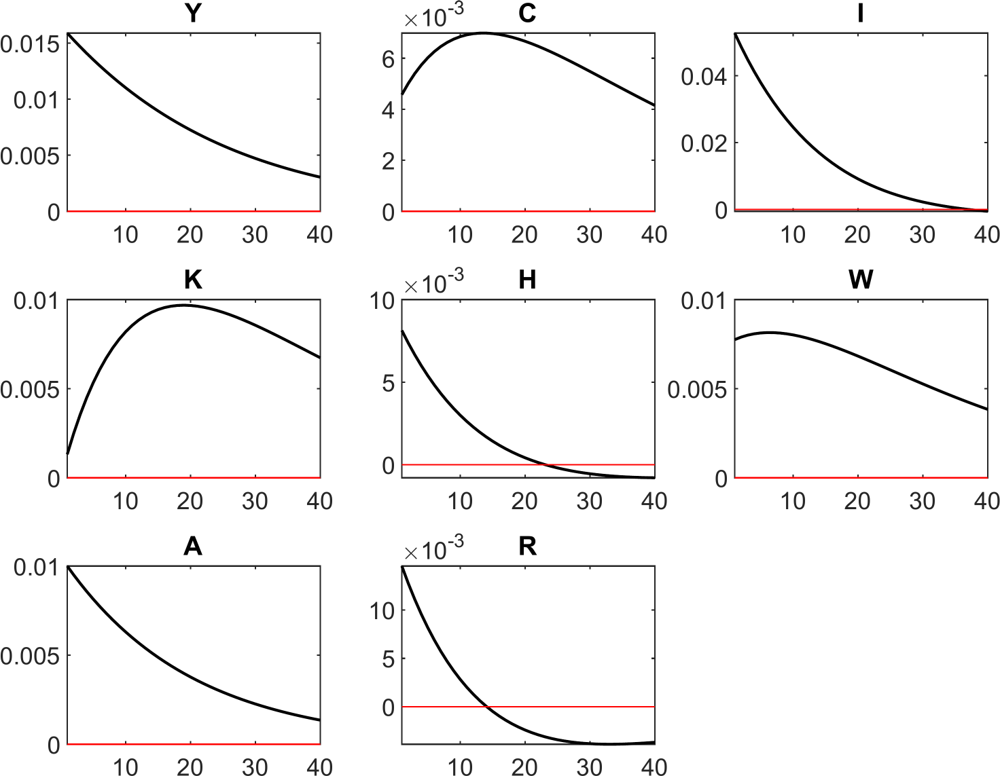

<!-- First: Set your default preferences for chunk options: -->

<!-- If you want a chunk's code to be printed, set echo = TRUE. message = FALSE stops R printing ugly package loading details in your final paper too. I also suggest setting warning = FALSE and checking for warnings in R, else you might find ugly warnings in your paper. -->

```{r setup, include=FALSE}
knitr::opts_chunk$set(echo = FALSE, message = FALSE, warning = FALSE, fig.width = 6, fig.height = 5, fig.pos="H", fig.pos = 'H')
# Note: Include = FALSE implies the code is executed, but not printed in your pdf.
# warning and message = FALSE implies ugly messages and warnings are removed from your pdf.
# These should be picked up when you execute the command chunks (code sections below) in your rmd, not printed in your paper!

# Lets load in example data, and see how this can be stored and later called from your 'data' folder.
if(!require("tidyverse")) install.packages("tidyverse")
library(tidyverse)
library(DynareR)
```


<!-- ############################## -->
<!-- # Start Writing here: -->
<!-- ############################## -->

```{r dynare-code-mod}

#Please note that this is not the correct mod file, but here for example purposes based on what i have currently 
dynareCodes_NKM <- '
/* === New Keynesian DSGE with Rotemberg Pricing === */

var c C i I M B K h Rb Rk W P Pi tau q Y Yj Pj MC A;
varexo eps_a eps_m;

parameters beta eta theta chi gamma psi delta phi epsilon alpha 
          rho_a rho_m sigma_a sigma_m;

model;
  // ====== HOUSEHOLD BLOCK ======
  // Nominal definitions
  C = P*c;
  I = P*i;

  // Budget constraint
  C + I + B + M = Rb(-1)*B(-1) + M(-1) + W*h + Rk(-1)*K(-1) + Pi - P*tau;

  // Capital accumulation with adjustment costs
  K = (1-delta)*K(-1) + I - (phi/2)*((I/K(-1)-delta)^2)*K(-1);

  // Consumption Euler with habit formation
  (c-eta*c(-1))^(-theta) = beta*E(Rb*(P/P(+1))*(c(+1)-eta*c)^(-theta));

  // Labour supply
  W/P = chi*h^gamma / 
        ((c-eta*c(-1))^(-theta) - beta*eta*E((c(+1)-eta*c)^(-theta)));

  // Money demand
  M = psi / (beta*E((Rb-1)*(
        ((c(+1)-eta*c)^(-theta) - beta*eta*E((c(+2)-eta*c(+1))^(-theta))
      )/P(+1)));

  // Tobin\'s q and capital Euler
  q = 1 - phi*(I/K(-1) - delta);
  beta*E( (c(+1)-eta*c)^(-theta) * Rb ) / q = 
  beta*E( (c(+1)-eta*c)^(-theta) * (
      Rk(+1) + (1/q(+1))*(1 - delta + (phi/2)*((I(+1)/K)^2 - delta^2)
  ));

  // ====== PRODUCTION BLOCK ======
  // Final goods aggregator (symmetric equilibrium)
  Y = Yj;  
  P = Pj;
  
  // Intermediate goods production
  Yj = A*(K(-1)^alpha)*(h^(1-alpha));  // Capital is predetermined
  
  // Marginal cost
  MC = (1/A)*((Rk/alpha)^alpha)*((W/(1-alpha))^(1-alpha));
  
  // Rotemberg price adjustment (NKPC)
  # pi = P/P(-1);  // Inflation definition
  (pi - 1)*pi = (epsilon/psi)*(MC/P - (epsilon-1)/epsilon) + 
                beta*E( 
                  ((c(+1)-eta*c)^(-theta)/((c-eta*c(-1))^(-theta)) * 
                  (Y(+1)/Y) * 
                  (pi(+1) - 1)*pi(+1) 
                );

  // Real profits
  Pi = P * [Y - (MC/P)*Y - (psi/2)*(pi - 1)^2 * Y];

  // ====== GOVERNMENT & CLEARING ======
  // Fiscal policy (lump-sum taxes)
  tau = 0;  // Placeholder - to be specified
  
  // Bond market clearing
  B = 0;  // Zero net supply
  
  // Resource constraint
  Y = c + i + (psi/2)*(pi - 1)^2 * Y;

  // ====== EXOGENOUS PROCESSES ======
  // TFP shock (log-linear)
  log(A) = rho_a*log(A(-1)) + sigma_a*eps_a;
end;

shocks;
  var eps_a; stderr sigma_a;
  var eps_m; stderr sigma_m;
end;
'

# will set eval to true when happy with MOD file
write_mod(
  code  = dynareCodes_NKM,
  model = "code/nkm_model"
)

```


I have used an R package from @{Mati2019} and should give credit. This allowed me to code everything in R while still using Dynare. 


# Model Specification


Above could note be a heading on itself. Just a paragraph that it is a core rbc foundations and what that means. 

Note that capital letters denote nominal amounts and lowercase denote real values.

Mainly adding capital to  @sims2024newkeynesian, while also introducing adjustment costs from @sims2024rbc . Rotemberg prices was used while gleeming insights from @ecbwp770 .


## Households 

\begin{equation}
C_t \;=\; P_t \, c_t,
\qquad
I_t \;=\; P_t \, i_t
\label{nominal_definitions}
\end{equation}

\begin{equation}
\max_{\{C_t,\,h_t,\,M_t,\,B_t,\,K_t,\,I_t\}}
\mathbb{E}_0 \sum_{t=1}^{\infty} \beta^{t-1}
\left[
\frac{\Bigl(\frac{C_t}{P_t} - \eta\,\frac{C_{t-1}}{P_{t-1}}\Bigr)^{1-\theta}}{1-\theta}
\;-\;\chi\,\frac{h_t^{1+\gamma}}{1+\gamma}
\;+\;\psi\,\ln\!\Bigl(\frac{M_t}{P_t}\Bigr)
\right]
\label{lifetime_utility_nominal}
\end{equation}


\begin{equation}
C_t \;+\; I_t \;+\; B_t \;+\; M_t
\;\le\;
R^B_{\,t-1}\,B_{t-1}
\;+\; M_{t-1}
\;+\; W_t\,h_t
\;+\; R^k_t\,K_{t-1}
\;+\; \Pi_t
\;-\; P_t\,\tau_t
\label{flow_constraint_nominal}
\end{equation}


\begin{equation}
K_t
\;=\;
(1 - \delta)\,K_{t-1}
\;+\; I_t
\;-\;\frac{\phi}{2}
\left(\frac{I_t}{K_{t-1}} - \delta\right)^{2}
\,K_{t-1}
\label{capital_accumulation_nominal}
\end{equation}


From which we can derive the following equations, found in full form in Appendix \ref{household_FOC}

\begin{equation}\label{consEuler}
  (c_t - \eta\,c_{t-1})^{-\theta}
  \;=\;
  \beta\,\mathbb{E}_t\!\Bigl[
    R_t^B \;\frac{P_t}{P_{t+1}}\;(c_{t+1} - \eta\,c_t)^{-\theta}
  \Bigr]
\end{equation}


Equation \ref{consEuler} describes the household’s optimal consumption decision over time. On the left-hand side, we have the marginal utility of consumption today, which takes into account *habit formation* - meaning that current satisfaction from consuming $c_t$ is reduced if past consumption $c_{t-1}$ was high. The right-hand side reflects the expected marginal benefit of postponing consumption to the next period: it combines the expected *real return* on bonds, $R_t^B \cdot \frac{P_t}{P_{t+1}}$, with the marginal utility of tomorrow’s (habit-adjusted) consumption, $c_{t+1} - \eta\,c_t$.

Put simply, households balance the gain from consuming now against the expected value of saving and consuming later. Habit persistence, captured by $\eta$, introduces a kind of “inertia” in consumption preferences, while inflation, through the price ratio $\frac{P_t}{P_{t+1}}$, adjusts the real value of future returns.


\begin{equation}\label{labourSupply}
  \frac{W_t}{P_t}
  \;=\;
  \frac{\chi\,h_t^{\gamma}}
       {(c_t - \eta\,c_{t-1})^{-\theta}
        \;-\;
        \beta\,\eta\,\mathbb{E}_t\!\bigl[(c_{t+1} - \eta\,c_t)^{-\theta}\bigr]}
\end{equation}

Equation \ref{labourSupply} links the real wage $\frac{W_t}{P_t}$ to the household’s labour supply decision. The right-hand side captures the trade-off between working more hours, $h_t$, and the (habit-adjusted) marginal utility of consumption. Stronger habit formation ($\eta$) lowers the perceived benefit of consumption, so households require a higher real wage to be willing to work the same amount - especially when the disutility of labour rises more steeply with hours ($\gamma$ large).


\begin{equation}\label{money_demand}
  M_t
  \;=\;
  \frac{\psi}
       {\beta\,\mathbb{E}_t\!\Bigl[
         (R_t^B - 1)
         \;\cdot\;
         \dfrac{(c_{t+1} - \eta\,c_t)^{-\theta}
               \;-\;
               \beta\,\eta\,\mathbb{E}_{t+1}[(c_{t+2} - \eta\,c_{t+1})^{-\theta}]}
              {P_{t+1}}
       \Bigr]}
\end{equation}


Equation \ref{money_demand} characterises money demand as inversely related to the expected return on bonds - the higher the nominal rate $(R_t^B - 1)$, the greater the opportunity cost of holding money. The expression in the denominator reflects the *liquidity premium*, adjusted for how habits ($\eta$) and expected future consumption affect the marginal utility of spending. Inflation expectations, via $P_{t+1}$, also influence how attractive money is relative to interest-bearing assets.


\begin{equation}\label{capital_euler}
  \begin{gathered}
  q_t \;\equiv\; 1 - \phi\,\Bigl(\tfrac{I_t}{K_{t-1}} - \delta\Bigr) \\
  \\
  \frac{\beta\,\mathbb{E}_t\!\bigl[\lambda_{t+1}\,R_t^B\bigr]}{q_t}
  \;=\;
  \beta\,\mathbb{E}_t\!\Bigl[
    \lambda_{t+1}\Bigl(
      R_{t+1}^k
      + \frac{1}{q_{t+1}}
        \Bigl(
          1 - \delta
          + \tfrac{\phi}{2}\bigl[(I_{t+1}/K_t)^2 - \delta^2\bigr]
        \Bigr)
    \Bigr)
  \Bigr]
  \end{gathered}
\end{equation}

Equation \ref{capital_euler} defines Tobin’s $q_t$ - the value of an additional unit of capital - and describes how firms decide whether to invest. When the ratio of investment to existing capital $\frac{I_t}{K_{t-1}}$ exceeds depreciation $\delta$, $q_t > 1$, signalling that it's profitable to expand the capital stock. The equation balances the bond-return-adjusted cost of investing (left-hand side) with the expected return on capital, including future capital gains and adjustment costs (right-hand side). The parameter $\phi$ governs these adjustment costs, meaning that rapid changes in investment are costly and create frictions.


## Production 


This model departs from standard RBC frameworks by introducing monopolistic competition and nominal rigidities. This is achieved through two layers of firms:  

1. **Perfectly competitive final goods producers** who aggregate intermediate goods  
2. **Monopolistically competitive intermediate goods producers** with price-setting power  

This structure allows us to capture key New Keynesian features while maintaining tractability.  


### Final Goods Producer

*(Perfectly competitive aggregator)*  

The final goods firm combines differentiated inputs \(Y_t(j)\) into final output \(Y_t\) using a CES technology:  

\begin{equation}  
Y_t = \left( \int_0^1 Y_t(j)^{\frac{\epsilon-1}{\epsilon}}  dj \right)^{\frac{\epsilon}{\epsilon-1}}, \quad \epsilon > 1  
\label{ces_production}  
\end{equation}  

Where \(\epsilon\) aptures the elasticity of substitution between varieties: the higher it is, the more easily final goods producers can substitute across inputs. Conversely, a lower \(\epsilon\) implies that intermediate producers face less competition and enjoy greater market power.

Given the CES aggregator in Equation \eqref{ces_production}, the final goods producer chooses input varieties to minimize the cost of delivering one unit of output. The resulting demand and pricing relationships, derived in Appendix \ref{final_good_producer_appendix}, are:

  
\begin{equation}  
Y_t(j) = \left( \frac{P_t(j)}{P_t} \right)^{-\epsilon} Y_t  
\label{demand_curve_final}  
\end{equation}  

  
\begin{equation}  
P_t = \left( \int_0^1 P_t(j)^{1-\epsilon}  dj \right)^{\frac{1}{1-\epsilon}}  
\label{aggregate_price_index}  
\end{equation}
  
  
Equation \ref{demand_curve_final} shows that more expensive varieties are purchased in smaller quantities, while Equation \ref{aggregate_price_index} reflects the minimum cost of assembling one unit of final output given prevailing input prices.


### Intermediate Goods Producers

**(Monopolistic competitors, indexed by \( j \in [0,1] \))** 


Each firm \(j\) produces with identical Cobb-Douglas technology:  
\begin{equation}
Y_t(j) = A_t K_t(j)^{\alpha} h_t(j)^{1-\alpha}
\label{intermediate_production}
\end{equation}

- Rent capital \(K_t(j)\) and labor \(h_t(j)\) at competitive rates \(R_t^k\), \(W_t\)  
- Face common TFP shocks \(A_t\)  


Minimizing costs yields nominal marginal cost (common to all firms - derived in Appendix \ref{intermediate_good_producer_appendix}):

\begin{equation}
\text{MC}_t = \frac{1}{A_t} \left( \frac{R_t^k}{\alpha} \right)^{\alpha} \left( \frac{W_t}{1-\alpha} \right)^{1-\alpha}
\label{marginal_cost}
\end{equation}

Firms face Rotemberg (1982) price adjustment costs. 

\[
\text{AdjCost}_t(j) = \frac{\psi}{2} \left( \frac{P_t(j)}{P_{t-1}(j)} - 1 \right)^2 Y_t
\]


The real profit function is:
\begin{equation}
\Pi_t(j) = \underbrace{\frac{P_t(j)}{P_t} Y_t(j)}_{\text{real revenue}} - \underbrace{\frac{MC_t}{P_t}\,\cdot Y_t(j)}_{\text{real cost}} - \underbrace{\frac{\psi}{2} \left( \frac{P_t(j)}{P_{t-1}(j)} - 1 \right)^2 Y_t}_{\text{adjustment cost}}
\label{firm_profit}
\end{equation}


\[
\max_{P_t(j)} \mathbb{E}_t \sum_{s=0}^{\infty} \beta^s \Lambda_{t,t+s} \left[
\frac{P_{t+s}(j)}{P_{t+s}} Y_{t+s}(j) - mc_{t+s} Y_{t+s}(j) - \frac{\psi}{2} \left( \frac{P_{t+s}(j)}{P_{t+s-1}(j)} - 1 \right)^2 Y_{t+s}
\right]
\]

where:
- \(\Lambda_{t,t+s} = \beta^s \frac{\lambda_{t+s}}{\lambda_t}\) = Stochastic discount factor (from households)
- \(mc_t = \frac{\text{MC}_t}{P_t}\) = Real marginal cost (eq \ref{marginal_cost})
- \(Y_t(j) = \left( \frac{P_t(j)}{P_t} \right)^{-\epsilon} Y_t\) (demand curve from eq \ref{demand_curve_final})


**Optimal Price Setting**  
    Each intermediate firm \(j\) maximizes discounted real profits, accounting for future adjustment costs. In symmetric equilibrium (\(P_t(j) = P_t\), \(\pi_t = P_t/P_{t-1}\)), this yields the **Rotemberg Phillips Curve**:
    
\begin{equation}
(\pi_t - 1)\pi_t = \frac{\epsilon}{\psi} \left( mc_t - \frac{\epsilon-1}{\epsilon} \right) + \beta \mathbb{E}_t \left[ \frac{\lambda_{t+1}}{\lambda_t} \frac{Y_{t+1}}{Y_t} (\pi_{t+1} - 1)\pi_{t+1} \right]
\label{nkpc}
\end{equation}

where \(mc_t = \text{MC}_t / P_t\) (real marginal cost) and \(\lambda_t\) is the household’s marginal utility of consumption. This links inflation to:  
    1. Deviations of real marginal cost from its flexible-price level \(\frac{\epsilon-1}{\epsilon}\)  
2. Expected future inflation (weighted by discounting and output growth)  
3. Adjustment cost parameter \(\psi\) (higher \(\psi\) = stickier prices)  


\ref{intermediate_good_producer_appendix}


\newpage


## Government Sector 

To ensure internal consistency, I introduce a simple government sector. The government issues one-period nominal bonds purchased by households, uses tax revenues to finance an exogenous stream of government spending, and services its debt obligations. The government budget constraint equates the sum of nominal spending and interest payments to the sum of new debt issuance and tax revenues. We assume lump-sum taxation and do not model Ricardian equivalence effects explicitly. Bonds held by households are thus assumed to be government-issued, closing the financial side of the model.


Gov budget constraint (nominal)
\begin{equation}
P_t G_t + R^B_{t-1} B_{t-1} = B_t + P_t \tau_t \label{Gov_Budget}
\end{equation}


The following is not decided upon, and probably will go in section \ref{PEA}. 
tax rule:
\begin{equation}
\tau_t = \tau_{ss} + \phi_b (b_{t-1} - b_{ss}) \quad \phi_b > 0 \label{Tax_Rule}
\end{equation}

bond market clearing:
\begin{align*}
B_t = B^g_t 
\end{align*}


Government spending process
\begin{equation}
\log(G_t) = (1-\rho_g)\log(G_{ss}) + \rho_g \log(G_{t-1}) + \varepsilon^g_t \label{Gov_Spending}
\end{equation}


# Policy, Equilibrium, and Aggregation \label{PEA}


 **Bond‐market clearing**

$$
     B_t \;=\; B^g_t
     \tag{Bond market clear}
$$

   Bonds held by households are exactly the bonds issued by government.

**Fiscal rules (exogenous processes)**
need laws of motion for $G_t$ and/or $\tau_t$.  Two  examples 

   * **Autoregressive spending**

     $$
       G_t \;=\;\rho_g\,G_{t-1} \;+\; \varepsilon^g_t
       \tag{Exog.\ spending}
     $$
   * **Autoregressive lump–sum tax**

     $$
       \tau_t \;=\;\rho_\tau\,\tau_{t-1} \;+\; \varepsilon^\tau_t
       \tag{Exog.\ tax}
     $$

   


## Exogenous Processes


Unsure on the following before i look up if it at all breaks my model
- TFP shock: $\ln A_t = (1-\rho_A)\ln A_{ss} + \rho_A \ln A_{t-1} + \varepsilon_t^A$

- Monetary policy shocks ($\varepsilon_t^r, \varepsilon_t^m$

## Equilibrium and Model Closure

- Output Gap: $\hat{Y}_t = Y_t - Y_t^n$ (natural rate output)

- Market clearing conditions

- Determinacy Requirements: Blanchard-Kahn conditions for policy rules


*Market Clearing*
Aggregate production:
\begin{equation}
Y_t = A_t K_{t-1}^{\alpha} h_t^{1-\alpha}
\label{aggregate_production}
\end{equation}

Resource constraint (adjustment costs reduce output):
\begin{equation}
Y_t = C_t + I_t + \underbrace{\frac{\psi}{2} (\Pi_t - 1)^2 Y_t}_{\text{price adjustment cost}}
\label{resource_constraint}
\end{equation}

Factor markets clear:
\begin{align}
\int_0^1 h_t(j) dj &= h_t \\
\int_0^1 K_t(j) dj &= K_{t-1}
\end{align}


## Full Set of Conditions

Note that all equations will go here. 

# Steady State


```{r running-dynare, eval=FALSE}


nkm_results <- run_dynare(
  code       = dynareCodes_NKM,    # <— correct name here
  model      = "code/nkm_model",
  import_log = TRUE)

dynare$nkm_model$steady
```




\newpage
\newpage


# Appendix  

## Households

 
\begin{align*}
  & \text{Define Lagrangian} \\
  & \mathcal{L} = \mathbb{E}_0 \sum_{t=1}^{\infty} \beta^{t-1} \Bigl\{
    \underbrace{\frac{\bigl(\tfrac{C_t}{P_t}-\eta\tfrac{C_{t-1}}{P_{t-1}}\bigr)^{1-\theta}}{1-\theta}}_{\text{Consumption utility}}
    - \underbrace{\chi\frac{h_t^{1+\gamma}}{1+\gamma}}_{\text{Labor disutility}}
    + \underbrace{\psi\ln\bigl(\tfrac{M_t}{P_t}\bigr)}_{\text{Money utility}} \\
  & \quad\qquad
    + \underbrace{\lambda_t\bigl[R^B_{t-1}B_{t-1}+M_{t-1}+W_th_t+R^k_tK_{t-1}+\Pi_t-P_t\tau_t-C_t-I_t-B_t-M_t\bigr]}_{\text{Nominal flow constraint}}
    + \underbrace{\mu_t\bigl[(1-\delta)K_{t-1}+I_t-\tfrac{\phi}{2}(\tfrac{I_t}{K_{t-1}}-\delta)^2K_{t-1}-K_t\bigr]}_{\text{Capital accumulation}}
  \Bigr\}
\end{align*}


### First Order Conditions \label{household_FOC}


**FOC w.r.t. Consumption** :
\begin{align*}
  & \frac{\partial \mathcal{L}}{\partial C_t} = 0 \\
  & \quad \bigl[(c_t-\eta c_{t-1})^{-\theta}/P_t - \lambda_t\bigr]
    - \beta\,\mathbb{E}_t\bigl[\eta\,(c_{t+1}-\eta c_t)^{-\theta}/P_t\bigr] = 0 \\[6pt]
  & \text{Combine terms over }1/P_t \\
  & \quad \frac{1}{P_t}\bigl[(c_t-\eta c_{t-1})^{-\theta} - \beta\eta\,\mathbb{E}_t[(c_{t+1}-\eta c_t)^{-\theta}]\bigr] - \lambda_t = 0 \\[6pt]
  & \text{Multiply by }P_t \\
  & \quad (c_t-\eta c_{t-1})^{-\theta} - \beta\eta\,\mathbb{E}_t[(c_{t+1}-\eta c_t)^{-\theta}] - \lambda_t P_t = 0
\end{align*}

\begin{equation}\label{foc_C}
\boxed{
  \lambda_t P_t = (c_t-\eta c_{t-1})^{-\theta} - \beta\eta\,\mathbb{E}_t\bigl[(c_{t+1}-\eta c_t)^{-\theta}\bigr]
}
\end{equation}


**FOC w.r.t. Labour** :
\begin{align*}
  & \frac{\partial \mathcal{L}}{\partial h_t} = 0 \\
  & \quad -\chi h_t^{\gamma} + \lambda_t W_t = 0 \\[6pt]
  & \text{Rearrange} \\
  & \quad \lambda_t W_t = \chi h_t^{\gamma}
\end{align*}

\begin{equation}\label{foc_h}
\boxed{\lambda_t W_t = \chi h_t^{\gamma}}
\end{equation}


**FOC w.r.t. Real Money Balances**:
\begin{align*}
  & \frac{\partial \mathcal{L}}{\partial M_t} = 0 \\
  & \quad \beta^{t-1}\bigl[\psi/M_t - \lambda_t\bigr] + \beta^t\mathbb{E}_t[\lambda_{t+1}] = 0 \\[6pt]
  & \text{Divide by }\beta^{t-1}\text{ and rearrange} \\
  & \quad \psi/M_t - \lambda_t + \beta\,\mathbb{E}_t[\lambda_{t+1}] = 0
\end{align*}

\begin{equation}\label{foc_M}
\boxed{\frac{\psi}{M_t} = \lambda_t - \beta\,\mathbb{E}_t[\lambda_{t+1}]}
\end{equation}


**FOC w.r.t. Bonds** \eqref{foc_B}):
\begin{align*}
  & \frac{\partial \mathcal{L}}{\partial B_t} = 0 \\
  & \quad -\beta^{t-1}\lambda_t + \beta^t\mathbb{E}_t[\lambda_{t+1}R^B_t] = 0 \\[6pt]
  & \text{Divide by }\beta^{t-1}\text{ and simplify} \\
  & \quad -\lambda_t + \beta\,\mathbb{E}_t[\lambda_{t+1}R^B_t] = 0
\end{align*}

\begin{equation}\label{foc_B}
\boxed{\lambda_t = \beta\,\mathbb{E}_t[\lambda_{t+1}R^B_t]}
\end{equation}


**FOC w.r.t. Capital** :
\begin{align*}
  & \frac{\partial \mathcal{L}}{\partial K_t} = 0 \\
  & \quad -\beta^{t-1}\mu_t + \beta^t\mathbb{E}_t\bigl[\lambda_{t+1}R^k_{t+1} + \mu_{t+1}(1-\delta + \tfrac{\phi}{2}((I_{t+1}/K_t)^2 - \delta^2))\bigr] = 0 \\[6pt]
  & \text{Divide by }\beta^{t-1}\text{ and solve} \\
  & \quad \mu_t = \beta\,\mathbb{E}_t\bigl[\lambda_{t+1}R^k_{t+1} + \mu_{t+1}(1-\delta + \tfrac{\phi}{2}((I_{t+1}/K_t)^2 - \delta^2))\bigr]
\end{align*}

\begin{equation}\label{foc_K}
\boxed{\mu_t = \beta\,\mathbb{E}_t\bigl[\lambda_{t+1}R^k_{t+1} + \mu_{t+1}(1-\delta + \tfrac{\phi}{2}((I_{t+1}/K_t)^2 - \delta^2))\bigr]}
\end{equation}


**FOC w.r.t. Investment** :
\begin{align*}
  & \frac{\partial \mathcal{L}}{\partial I_t} = 0 \\
  & \quad \beta^{t-1}\bigl[-\lambda_t + \mu_t(1 - \phi(\tfrac{I_t}{K_{t-1}} - \delta))\bigr] = 0 \\[6pt]
  & \text{Divide by }\beta^{t-1}\text{ and isolate} \\
  & \quad \lambda_t = \mu_t\bigl(1 - \phi(\tfrac{I_t}{K_{t-1}} - \delta)\bigr)
\end{align*}

\begin{equation}\label{foc_I}
\boxed{\lambda_t = \mu_t\bigl(1 - \phi(\tfrac{I_t}{K_{t-1}} - \delta)\bigr)}
\end{equation}


### Household Final Equations

**Consumption Euler Equation**  
Combines consumption--habit dynamics with bond returns (from \eqref{foc_B} and \eqref{foc_C}) :  

\begin{align*}
& \text{Start with FOC for Bonds} \\
& \lambda_t = \beta\,\mathbb{E}_t[\lambda_{t+1}R_t^B] \quad \text{(Equation \ref{foc_B})} \\
& \\
& \text{Substitute } \lambda_t \text{ and } \lambda_{t+1} \text{ from FOC for Consumption} \\
& \lambda_t = \frac{(c_t - \eta\,c_{t-1})^{-\theta}}{P_t} \quad \text{(from Equation \ref{foc_C} rearranged)} \\
& \lambda_{t+1} = \frac{(c_{t+1} - \eta\,c_t)^{-\theta}}{P_{t+1}} \quad \text{(time-shifted)} \\
& \\
& \text{Combine results} \\
& \frac{(c_t - \eta\,c_{t-1})^{-\theta}}{P_t} = \beta\,\mathbb{E}_t\!\left[ R_t^B \cdot \frac{(c_{t+1} - \eta\,c_t)^{-\theta}}{P_{t+1}} \right] \\
& \\
& \text{Clear denominator} \\
& (c_t - \eta\,c_{t-1})^{-\theta} = \beta\,\mathbb{E}_t\!\left[ R_t^B \cdot \frac{P_t}{P_{t+1}} \cdot (c_{t+1} - \eta\,c_t)^{-\theta} \right]
\end{align*}


\begin{equation}\label{consEuler_app}
\boxed{%
  (c_t - \eta\,c_{t-1})^{-\theta}
  \;=\;
  \beta\,\mathbb{E}_t\!\Bigl[
    R_t^B \;\frac{P_t}{P_{t+1}}\;(c_{t+1} - \eta\,c_t)^{-\theta}
  \Bigr]
}
\end{equation}


**Labour Supply**  

Real wage equals the marginal rate of substitution between leisure and consumption (from \eqref{foc_C} and \eqref{foc_h}) :

\begin{align*}
& \text{Start with FOC for Hours Worked} \\
& \lambda_t W_t = \chi\,h_t^{\gamma} \quad \text{(Equation \ref{foc_h})} \\
& \\
& \text{Solve for } \lambda_t \\
& \lambda_t = \frac{\chi\,h_t^{\gamma}}{W_t} \\
& \\
& \text{Equate to FOC of Consumption expression} \\
& \frac{\chi\,h_t^{\gamma}}{W_t} = \frac{(c_t - \eta\,c_{t-1})^{-\theta} - \beta\,\eta\,\mathbb{E}_t[(c_{t+1} - \eta\,c_t)^{-\theta}]}{P_t} \\
& \\
& \text{Solve for real wage } (W_t/P_t) \\
& \frac{W_t}{P_t} = \frac{\chi\,h_t^{\gamma}}{(c_t - \eta\,c_{t-1})^{-\theta} - \beta\,\eta\,\mathbb{E}_t[(c_{t+1} - \eta\,c_t)^{-\theta}]}
\end{align*}

\begin{equation}\label{labourSupply_app}
\boxed{
  \frac{W_t}{P_t}
  \;=\;
  \frac{\chi\,h_t^{\gamma}}
       {(c_t - \eta\,c_{t-1})^{-\theta}
        \;-\;
        \beta\,\eta\,\mathbb{E}_t\!\bigl[(c_{t+1} - \eta\,c_t)^{-\theta}\bigr]}
}
\end{equation}


**Money Demand**  
Opportunity cost of holding money vs. bonds (from \eqref{foc_M}, \eqref{foc_B} and \eqref{foc_C})  :

\begin{align*}
& \text{Combine FOC for Money and Bonds} \\
& \frac{\psi}{M_t} = \lambda_t - \beta\,\mathbb{E}_t[\lambda_{t+1}] \quad \text{(Equation \ref{foc_M})} \\
& \lambda_t = \beta\,\mathbb{E}_t[\lambda_{t+1}R_t^B] \quad \text{(Equation \ref{foc_B})} \\
& \\
& \text{Substitute } \lambda_t \text{ into FOC of money} \\
& \frac{\psi}{M_t} = \beta\,\mathbb{E}_t[\lambda_{t+1}R_t^B] - \beta\,\mathbb{E}_t[\lambda_{t+1}] \\
& \frac{\psi}{M_t} = \beta\,\mathbb{E}_t\left[\lambda_{t+1}(R_t^B - 1)\right] \\
& \\
& \text{Substitute } \lambda_{t+1} \text{ from FOC of Consumption} \\
& \lambda_{t+1} = \frac{(c_{t+1} - \eta\,c_t)^{-\theta} - \beta\,\eta\,\mathbb{E}_{t+1}[(c_{t+2} - \eta\,c_{t+1})^{-\theta}]}{P_{t+1}} \\
& \\
& \text{Solve for } M_t \\
& M_t = \frac{\psi}{\beta\,\mathbb{E}_t\!\left[ (R_t^B - 1) \cdot \dfrac{(c_{t+1} - \eta\,c_t)^{-\theta} - \beta\,\eta\,\mathbb{E}_{t+1}[(c_{t+2} - \eta\,c_{t+1})^{-\theta}]}{P_{t+1}} \right]}
\end{align*}

\begin{equation}\label{money_demand_app}
\boxed{
  M_t
  \;=\;
  \frac{\psi}
       {\beta\,\mathbb{E}_t\!\Bigl[
         (R_t^B - 1)
         \;\cdot\;
         \dfrac{(c_{t+1} - \eta\,c_t)^{-\theta}
               \;-\;
               \beta\,\eta\,\mathbb{E}_{t+1}[(c_{t+2} - \eta\,c_{t+1})^{-\theta}]}
              {P_{t+1}}
       \Bigr]}
}
\end{equation}


**Capital Euler Equation **
Defines Tobin’s \(q\) and links required returns on capital to bond returns (from \eqref{foc_I}, \eqref{foc_K} and \eqref{foc_B}) :

\begin{align*}
& \text{Define Tobin's } q \text{ from FOC for Investment} \\
& \lambda_t = \mu_t q_t \quad \text{where} \quad q_t \equiv 1 - \phi\left(\tfrac{I_t}{K_{t-1}} - \delta\right) \\
& \\
& \text{Rearrange FOC for Capital} \\
& \mu_t = \beta\,\mathbb{E}_t\!\left[ \lambda_{t+1}R_{t+1}^k + \mu_{t+1}\!\left(1-\delta + \tfrac{\phi}{2}\left[(I_{t+1}/K_t)^2 - \delta^2\right]\right) \right] \\
& \\
& \text{Substitute } \mu_t = \lambda_t / q_t \text{ and } \mu_{t+1} = \lambda_{t+1} / q_{t+1} \\
& \frac{\lambda_t}{q_t} = \beta\,\mathbb{E}_t\!\left[ \lambda_{t+1}R_{t+1}^k + \frac{\lambda_{t+1}}{q_{t+1}}\left(1-\delta + \tfrac{\phi}{2}\left[(I_{t+1}/K_t)^2 - \delta^2\right]\right) \right] \\
& \\
& \text{Factor } \lambda_{t+1} \\
& \frac{\lambda_t}{q_t} = \beta\,\mathbb{E}_t\!\left[ \lambda_{t+1} \left( R_{t+1}^k + \frac{1}{q_{t+1}}\left(1-\delta + \tfrac{\phi}{2}\left[(I_{t+1}/K_t)^2 - \delta^2\right]\right) \right) \right] \\
& \\
& \text{Substitute FOC for Bonds } (\lambda_t = \beta\,\mathbb{E}_t[\lambda_{t+1}R_t^B]) \\
& \frac{\beta\,\mathbb{E}_t[\lambda_{t+1}R_t^B]}{q_t} = \beta\,\mathbb{E}_t\!\left[ \lambda_{t+1} \left( R_{t+1}^k + \frac{1}{q_{t+1}}\Gamma_{t+1} \right) \right] \\
& \text{where } \Gamma_{t+1} \equiv 1-\delta + \tfrac{\phi}{2}\left[(I_{t+1}/K_t)^2 - \delta^2\right]
\end{align*}

\begin{equation}\label{capital_euler_app}
\boxed{
  \begin{gathered}
  q_t \;\equiv\; 1 - \phi\,\Bigl(\tfrac{I_t}{K_{t-1}} - \delta\Bigr) \\
  \\
  \frac{\beta\,\mathbb{E}_t\!\bigl[\lambda_{t+1}\,R_t^B\bigr]}{q_t}
  \;=\;
  \beta\,\mathbb{E}_t\!\Bigl[
    \lambda_{t+1}\Bigl(
      R_{t+1}^k
      + \frac{1}{q_{t+1}}
        \Bigl(
          1 - \delta
          + \tfrac{\phi}{2}\bigl[(I_{t+1}/K_t)^2 - \delta^2\bigr]
        \Bigr)
    \Bigr)
  \Bigr]
  \end{gathered}
}
\end{equation}


## Production 
### Final Good Producer \label{final_good_producer_appendix}

**Derivation of Intermediate Goods Demand and Aggregate Price Index**  

\begin{align*}  
& \text{Final goods producer's profit:} \\  
& \Pi_t = P_t Y_t - \int_0^1 P_t(j) Y_t(j)  dj \\  
& \text{subject to } Y_t = \left( \int_0^1 Y_t(j)^{\frac{\epsilon-1}{\epsilon}}  dj \right)^{\frac{\epsilon}{\epsilon-1}} \\  
& \\  
& \text{Substitute production function into profit:} \\  
& \Pi_t = P_t \left( \int_0^1 Y_t(j)^{\frac{\epsilon-1}{\epsilon}}  dj \right)^{\frac{\epsilon}{\epsilon-1}} - \int_0^1 P_t(j) Y_t(j)  dj \\  
& \\  
& \text{First-order condition for } Y_t(j): \\  
& \frac{\partial \Pi_t}{\partial Y_t(j)} = P_t \cdot \frac{\epsilon}{\epsilon-1} \left( \int_0^1 Y_t(i)^{\frac{\epsilon-1}{\epsilon}}  di \right)^{\frac{1}{\epsilon-1}} \cdot \frac{\epsilon-1}{\epsilon} Y_t(j)^{-\frac{1}{\epsilon}} - P_t(j) = 0 \\  
& \Rightarrow P_t \cdot Y_t^{\frac{1}{\epsilon}} Y_t(j)^{-\frac{1}{\epsilon}} = P_t(j) \\  
& \\  
& \text{Rearrange to obtain demand curve:} \\  
& Y_t(j) = \left( \frac{P_t}{P_t(j)} \right)^{\epsilon} Y_t \\  
& \\  
& \text{Substitute demand into production function:} \\  
& Y_t = \left( \int_0^1 \left[ \left( \frac{P_t}{P_t(j)} \right)^{\epsilon} Y_t \right]^{\frac{\epsilon-1}{\epsilon}}  dj \right)^{\frac{\epsilon}{\epsilon-1}} \\  
& = Y_t \left( \int_0^1 \left( \frac{P_t}{P_t(j)} \right)^{\epsilon-1}  dj \right)^{\frac{\epsilon}{\epsilon-1}} \\  
& \\
\end{align*}
\begin{align*} 
& \text{Simplify to obtain price index:} \\  
& 1 = \left( \int_0^1 \left( \frac{P_t}{P_t(j)} \right)^{\epsilon-1}  dj \right)^{\frac{\epsilon}{\epsilon-1}} \\  
& \Rightarrow P_t^{1-\epsilon} = \int_0^1 P_t(j)^{1-\epsilon}  dj \\  
& \Rightarrow P_t = \left( \int_0^1 P_t(j)^{1-\epsilon}  dj \right)^{\frac{1}{1-\epsilon}}  
\end{align*}  

\begin{equation}\label{demand_and_price}  
\boxed{  
  \begin{gathered}  
  Y_t(j) = \left( \frac{P_t(j)}{P_t} \right)^{-\epsilon} Y_t \\  
  \\  
  P_t = \left( \int_0^1 P_t(j)^{1-\epsilon}  dj \right)^{\frac{1}{1-\epsilon}}  
  \end{gathered}  
}  
\end{equation}  

### Intermediate Goods Producers \label{intermediate_good_producer_appendix}

\begin{align*}
& \text{Cost minimization for intermediate firm } j: \\
& \min_{K_t(j), h_t(j)} \left\{ R_t^k K_t(j) + W_t h_t(j) \right\} \\
& \text{subject to } Y_t(j) = A_t K_t(j)^{\alpha} h_t(j)^{1-\alpha} \\
& \\
& \text{Lagrangian:} \\
& \mathcal{L} = R_t^k K_t(j) + W_t h_t(j) + \lambda_t \left[ A_t K_t(j)^{\alpha} h_t(j)^{1-\alpha} - Y_t(j) \right] \\
& \\
& \text{First-order conditions:} \\
& \frac{\partial \mathcal{L}}{\partial K_t(j)} = 0: \quad R_t^k = \lambda_t \alpha A_t K_t(j)^{\alpha-1} h_t(j)^{1-\alpha} \\
& \frac{\partial \mathcal{L}}{\partial h_t(j)} = 0: \quad W_t = \lambda_t (1-\alpha) A_t K_t(j)^{\alpha} h_t(j)^{-\alpha} \\
& \\
& \text{Rearrange FOCs:} \\
& \lambda_t = \frac{R_t^k}{\alpha} \left( \frac{K_t(j)}{h_t(j)} \right)^{1-\alpha} \frac{1}{A_t}, \quad 
\lambda_t = \frac{W_t}{1-\alpha} \left( \frac{K_t(j)}{h_t(j)} \right)^{\alpha} \frac{1}{A_t} \\
& \\
& \text{Equate expressions:} \\
& \frac{R_t^k}{\alpha} \left( \frac{K_t(j)}{h_t(j)} \right)^{-\alpha} = \frac{W_t}{1-\alpha} \left( \frac{K_t(j)}{h_t(j)} \right)^{1-\alpha} \\
& \Rightarrow \frac{K_t(j)}{h_t(j)} = \frac{\alpha}{1-\alpha} \frac{W_t}{R_t^k} \\
& \\
& \text{Substitute into capital FOC:} \\
& \lambda_t = \frac{R_t^k}{\alpha A_t} \left( \frac{\alpha}{1-\alpha} \frac{W_t}{R_t^k} \right)^{\alpha-1} \\
& = \frac{1}{A_t} \left( \frac{R_t^k}{\alpha} \right)^{\alpha} \left( \frac{W_t}{1-\alpha} \right)^{1-\alpha}
\end{align*}

\begin{equation}\label{marginal_cost}
\boxed{MC_t = \dfrac{1}{A_t} \left( \dfrac{R_t^k}{\alpha} \right)^{\alpha} \left( \dfrac{W_t}{1-\alpha} \right)^{1-\alpha}}
\end{equation}


\begin{align*}
& \text{Intermediate‐goods producer’s problem:} \\
& \max_{P_t(j)} \;\mathbb{E}_t \sum_{s=0}^{\infty} \Lambda_{t,t+s}
  \Bigl[
    \bigl(\tfrac{P_{t+s}(j)}{P_{t+s}}\bigr)^{1-\epsilon} Y_{t+s}
    - mc_{t+s}\,\bigl(\tfrac{P_{t+s}(j)}{P_{t+s}}\bigr)^{-\epsilon} Y_{t+s}
    - \tfrac{\psi}{2}\bigl(\tfrac{P_{t+s}(j)}{P_{t+s-1}(j)} - 1\bigr)^2 Y_{t+s}
  \Bigr] \\
& \text{subject to} \quad Y_t(j) = \bigl(\tfrac{P_t(j)}{P_t}\bigr)^{-\epsilon} Y_t
\\[1.5ex]
& \text{First‐Order Condition w.r.t. }P_t(j): \\
& \mathbb{E}_t\Bigl[
    \frac{\partial \Pi_t(j)}{\partial P_t(j)}
    + \beta\,\Lambda_{t,t+1}
      \frac{\partial \Pi_{t+1}(j)}{\partial P_t(j)}
  \Bigr] = 0
\\[1ex]
& \frac{\partial \Pi_t}{\partial P_t(j)}
  = (1-\epsilon)\bigl(\tfrac{P_t(j)}{P_t}\bigr)^{-\epsilon}\tfrac{Y_t}{P_t}
    + \epsilon\,mc_t\bigl(\tfrac{P_t(j)}{P_t}\bigr)^{-\epsilon-1}\tfrac{Y_t}{P_t}
    - \psi\bigl(\tfrac{P_t(j)}{P_{t-1}(j)}-1\bigr)\tfrac{Y_t}{P_{t-1}(j)}
\\[1ex]
& \frac{\partial \Pi_{t+1}}{\partial P_t(j)}
  = \psi\bigl(\tfrac{P_{t+1}(j)}{P_t(j)}-1\bigr)\,\tfrac{P_{t+1}(j)}{P_t(j)^2}\,Y_{t+1}
\\[2ex]
& \text{Impose symmetry: }P_t(j)=P_t,\;Y_t(j)=Y_t,\;\pi_t=\tfrac{P_t}{P_{t-1}}.\\
& (1-\epsilon)+\epsilon\,mc_t = \epsilon\bigl(mc_t-\tfrac{\epsilon-1}{\epsilon}\bigr),\quad
  \tfrac{P_t(j)}{P_{t-1}(j)}=\pi_t,\;\tfrac{P_{t+1}(j)}{P_t(j)}=\pi_{t+1}
\\[1ex]
& 0 = \epsilon\bigl(mc_t-\tfrac{\epsilon-1}{\epsilon}\bigr)
      - \psi\,(\pi_t-1)\,\pi_t
      + \beta\,\mathbb{E}_t\Bigl[
          \Lambda_{t,t+1}\,\psi\,(\pi_{t+1}-1)\,\pi_{t+1}
          \,\tfrac{Y_{t+1}P_t}{Y_tP_{t+1}}
        \Bigr]
\\[1ex]
\end{align*}


Noting \(\Lambda_{t,t+1}=\beta\,\tfrac{\lambda_{t+1}}{\lambda_t}\) and \(P_{t+1}/P_t=\pi_{t+1}\), the bracket simplifies to \(\beta\,\tfrac{\lambda_{t+1}}{\lambda_t}\,\tfrac{Y_{t+1}}{Y_t}\).

\begin{equation}\label{rotemberg_FOC}
\boxed{
  0 = \epsilon\Bigl(mc_t - \tfrac{\epsilon-1}{\epsilon}\Bigr)
      - \psi\,(\pi_t - 1)\,\pi_t
      + \beta\,\mathbb{E}_t\!
        \Bigl[
          \tfrac{\lambda_{t+1}}{\lambda_t}\,
          \psi\,(\pi_{t+1}-1)\,\pi_{t+1}\,
          \tfrac{Y_{t+1}}{Y_t}
        \Bigr]
}
\end{equation}


\newpage


\newpage
# Old Stuff

Components breakdown:

Expenditures:

Consumption: $P_t c_t$

Investment: $P_t i_t$

Bonds: $B_t$

Money holdings: $M_t$

Income sources:

Bond returns: $(1 + i_{t-1}) B_{t-1}$

Money carryover: $M_{t-1}$

Labor income: $W_t h_t$

Capital returns: $R_t^k K_{t-1}$ (Key addition missing in Sims)

Firm profits: $\Pi_t$

Net transfers: $-P_t \tau_t$


\newpage

# References


```{r model from class,eval=FALSE}


# Note that this is my original MOD file that we used in class, it is here as a means to check if my code actually works in terms of running dynare in R (it does, and i will keep it here as a backup to check in future)
dynareCodes='%%%%%%%%%%%%%%%%%%%%%%%%%%%%%%%%%%%%%%%%%%
% RBC model with Labor and Log Utility 
% Based on image equations (10)–(17)
% Corrected for B&K conditions (loglinear TFP)
%%%%%%%%%%%%%%%%%%%%%%%%%%%%%%%%%%%%%%%%%%

var C               // Consumption
    I               // Investment
    Y               // Output
    K               // Capital stock
    R               // Return on Capital
    W               // Wage
    H               // Hours worked
    A;              // Productivity level

varexo eps;         // TFP shock

parameters beta alpha delta rho chi;

beta  = 0.99;       // Discount factor
alpha = 0.33;       // Capital share
delta = 0.025;      // Depreciation rate
rho   = 0.95;       // TFP shock persistence
chi   = 2.24;       // Labor disutility parameter

model;
    // (10) Euler equation
    1/C = beta * (1/C(+1)) * (R(+1) + 1 - delta);

    // (11) Labor-leisure trade-off
    (1/C) * W = chi / (1 - H);

    // (12) Resource constraint
    C + I = Y;

    // (13) Return on capital
    R = alpha * Y / K;

    // (14) Wage equation
    W = (1 - alpha) * Y / H;

    // (15) Capital accumulation
    I = K - (1 - delta) * K(-1);

    // (16) Cobb-Douglas production
    Y = A * K^alpha * H^(1 - alpha);

    // (17) Log TFP process
    log(A) = rho * log(A(-1)) + eps;
end;

initval;
    A = 1;
    K = ((alpha * beta / (1 - beta * (1 - delta)))^(1/(1 - alpha)));
    H = 0.33;
    Y = A * K^alpha * H^(1 - alpha);
    I = delta * K;
    C = Y - I;
    R = alpha * Y / K;
    W = (1 - alpha) * Y / H;
end;


steady;
check;
resid;

shocks;
    var eps = 0.01^2; // 1% standard deviation TFP shock
 end;

stoch_simul(order=1, irf=40, hp_filter=1600, loglinear,graph_format=fig) Y C I K H W A R;'

```


```{r, eval=FALSE}

# again this is old code only used for dynostic checking
# 1. Write the .mod file into the code/ folder
write_mod(
  code  = dynareCodes,
  model = "code/rbc_model"
)

# 2. Run Dynare and import the log
rbc_results <- run_dynare(
  code       = dynareCodes,
  model      = "code/rbc_model",
  import_log = TRUE
)
```
