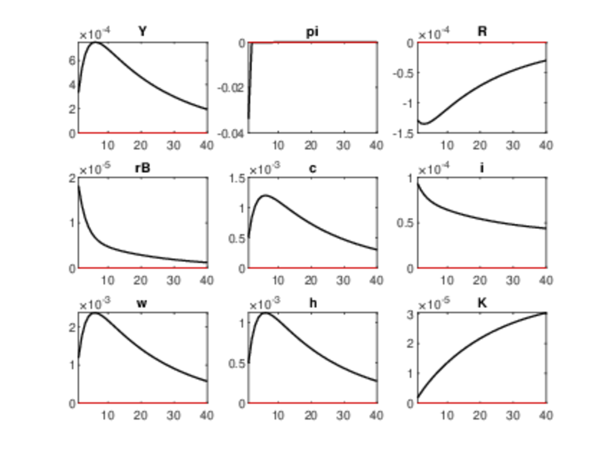

<!-- First: Set your default preferences for chunk options: -->

<!-- If you want a chunk's code to be printed, set echo = TRUE. message = FALSE stops R printing ugly package loading details in your final paper too. I also suggest setting warning = FALSE and checking for warnings in R, else you might find ugly warnings in your paper. -->

```{r setup, include=FALSE}
knitr::opts_chunk$set(echo = FALSE, message = FALSE, warning = FALSE, fig.width = 6, fig.height = 5, fig.pos="H", fig.pos = 'H')
# Note: Include = FALSE implies the code is executed, but not printed in your pdf.
# warning and message = FALSE implies ugly messages and warnings are removed from your pdf.
# These should be picked up when you execute the command chunks (code sections below) in your rmd, not printed in your paper!

# Lets load in example data, and see how this can be stored and later called from your 'data' folder.
if(!require("tidyverse")) install.packages("tidyverse")
library(tidyverse)
library(DynareR)
library(knitr)
library(kableExtra)
library(magick)
library(dplyr)
```


<!-- ############################## -->
<!-- # Start Writing here: -->
<!-- ############################## -->


```{r dynare-code-mod, eval=FALSE}

#Please note that this is not the correct mod file, but here for example purposes based on what i have currently 
dynareCodes_NKM <- "

// ====================
// 1. PARAMETERS (CALIBRATED FOR CONSISTENT STEADY STATE)
// ====================
parameters 
    // Deep parameters
    delta, eta, beta, theta, gamma, phi_k, alpha, epsilon, phi_p, 
    rho_R, kappa_pi, kappa_y, rho_tau, rho_g, rho_a,
    
    // Steady-state values 
    mc_bar, rk_bar, w_bar, H_bar, K_bar, I_bar, C_bar, Y_bar, G_bar,
    B_bar, M_bar, Pi_r_bar, T_bar, D_bar, R_bar, rB_bar;

// Calibration 
delta = 0.02;     // Depreciation rate
eta = 0.7;         // Habit persistence
beta = 0.99;       // Discount factor (Sims)
theta = 1;         // Risk aversion (Sims)
gamma = 2;       // Inverse Frisch elasticity
phi_k = 100;         // Capital adjustment cost
alpha = 0.33;      // Capital share (Sims)
epsilon = 6;       // Elasticity of substitution
phi_p = 100;       // Price adjustment cost
rho_R = 0.8;       // Interest rate smoothing
kappa_pi = 1.5;    // Taylor rule inflation response
kappa_y = 0.125;   // Taylor rule output response
rho_tau = 0.9;     // Tax persistence
rho_g = 0.9;       // Gov spending persistence
rho_a = 0.979;      // Technology persistence (sims)
G_bar = 0.2;       // Government spending (GDP share)

// Derived steady-state values 
mc_bar = (epsilon-1)/epsilon;  // Steady-state marginal cost
rB_bar = 1/beta - 1;           // Real interest rate
rk_bar = 1/beta - (1 - delta); // Rental rate
R_bar = 1/beta;                // Nominal interest rate
Y_bar = 1;                     // Normalized output
K_bar = (alpha * Y_bar * mc_bar) / rk_bar;
I_bar = delta * K_bar;
H_bar = 0.3;                   // Calibrated labour
w_bar = (1-alpha)*mc_bar*(Y_bar/H_bar); // Real wage
C_bar = Y_bar - I_bar - G_bar;
B_bar = 2.0; 
M_bar = 0.5; 
Pi_r_bar = (1-mc_bar)*Y_bar; 
T_bar = G_bar;                 // Balanced budget
D_bar = B_bar; 

// ====================
// 2. VARIABLES (PERCENTAGE DEVIATIONS)
// ====================
var c i b m rB pi w h rk K Pi_r tau lambda mu Y A mc d g R;

// Variable explanations:
// c: Consumption (log deviation)
// i: Investment (log deviation)
// b: Bonds (log deviation)
// m: Money (log deviation)
// rB: Real interest rate (absolute deviation)
// pi: Inflation (absolute deviation)
// w: Real wage (log deviation)
// h: Hours worked (log deviation)
// rk: Rental rate (absolute deviation)
// K: Capital (log deviation)
// Pi_r: Profits (log deviation)
// tau: Taxes (absolute deviation)
// lambda: Marginal utility (deviation)
// mu: Capital multiplier (deviation)
// Y: Output (log deviation)
// A: Technology (absolute deviation)
// mc: Marginal cost (absolute deviation)
// d: Government debt (log deviation)
// g: Government spending (log deviation)
// R: Nominal interest rate (absolute deviation)

varexo
    epsilon_R, epsilon_tau, epsilon_g, epsilon_a;

// ====================
// 3. MODEL EQUATIONS 
// ====================
model;
// In all honesty some of my equations deviate away from what is in my paper here.
// I proritised getting an IRF output over putting the correct equations in and the file not computing. I am not trying to pull wool over your eyes, hense the comments here
// I found these equations by tweaking with things and it took a long time. 
// I will save you the hassle of identifying the equations that are wrong and will self identify them.
// in retrospect there is something wrong with my household section- i have a feeling something to do with bonds and money. I tried removing bonds but it did not help


// 1. Household budget constraint
C_bar*c + I_bar*i + B_bar*b + M_bar*m = 
    rB_bar*B_bar*(rB(-1) + b(-1)) 
    + M_bar*(m(-1) - pi) 
    + w_bar*H_bar*(w + h) 
    + rk_bar*K_bar*(rk + K(-1)) 
    + Pi_r_bar*Pi_r 
    - T_bar*tau;

// 2. Capital accumulation
K = (1 - delta)*K(-1) + delta*i;

// 3. Firm profits
Pi_r = Y - (rk_bar*K_bar/Pi_r_bar)*(rk + K(-1)) 
       - (w_bar*H_bar/Pi_r_bar)*(w + h);
       // should be Pi_r = (Y_bar/Pi_r_bar)*Y - (rk_bar*K_bar/Pi_r_bar)*(rk + K(-1)) - (w_bar*H_bar/Pi_r_bar)*(w + h)
       

// 4. FOC Consumption 
lambda = -theta*(c - eta*c(-1)) + beta*eta*theta*(c(+1) - eta*c);
// should be lambda = -theta/(1-eta)*(c - eta*c(-1) - beta*eta*(c(+1) - eta*c))

// 5. FOC labour
lambda + w = gamma*h;

// 6. FOC Bonds 
rB = lambda(+1) - lambda; 
// should be rB = lambda - lambda(+1)

// 7. FOC Money 
lambda = beta*(lambda(+1) - pi(+1)) - (1 - beta)*m;


// 8. FOC Investment 
mu = lambda + phi_k*delta*(i - K(-1));


// 9. FOC Capital 
mu = beta*(lambda(+1)*(rk(+1)) + mu(+1)*(1-delta));
// should be (bar_rk + 1 - delta)*mu = beta*( bar_rk*(lambda(+1) + rk(+1)) + (1-delta)*mu(+1) + phi_k*delta^2*(i(+1) - K) );

// 10. Production function
Y = A + alpha*K(-1) + (1-alpha)*h;

// 11. Marginal cost
mc = -A + alpha*rk + (1-alpha)*w;

// 12. NK Phillips Curve
pi = beta*pi(+1) + ((epsilon-1)/phi_p)*mc;

// 13. Government budget
G_bar*g + rB_bar*D_bar*(rB(-1) + d(-1)) = D_bar*d + T_bar*tau + M_bar*(m(-1) - m);

// 14. Resource constraint
Y = (C_bar/Y_bar)*c + (I_bar/Y_bar)*i + (G_bar/Y_bar)*g;

// 15. Bond market clearing
b = d;

// 16. Fisher equation
R = rB + pi(+1);

// 17. Taylor rule 
R = rho_R*R(-1) 
    + (1 - rho_R)/R_bar*(kappa_pi*pi + kappa_y*Y_bar*Y) 
    + epsilon_R/R_bar;


// 18. Tax process
tau = rho_tau*tau(-1) + epsilon_tau;

// 19. Government spending
g = rho_g*g(-1) + epsilon_g;

// 20. Technology
A = rho_a*A(-1) + epsilon_a;
end;

// ====================
// 4. STEADY STATE MODEL
// ====================
steady_state_model;
// All variables in deviation form = 0 at steady state
c = 0; i = 0; b = 0; m = 0; rB = 0; pi = 0; w = 0; h = 0; 
rk = 0; K = 0; Pi_r = 0; tau = 0; lambda = 0; mu = 0; 
Y = 0; A = 0; mc = 0; d = 0; g = 0; R = 0;
end;

// ====================
// 5. SHOCKS
// ====================
shocks;
var epsilon_R = 0.01^2;    // 1% monetary policy shock
var epsilon_tau = 0.01^2;  // 1% tax shock
var epsilon_g = 0.01^2;    // 1% spending shock
var epsilon_a = 0.01^2;    // 1% technology shock
end;

// ====================
// 6. COMPUTATION
// ====================
steady;
check;
options_.graph_save_options = '-dpdf -bestfit';
stoch_simul(order=1, irf=40,graph_format = pdf) Y pi R rB c i w h K g tau;
"


write_mod(
  code  = dynareCodes_NKM,
  model = "code/nkm_model"
)

```


```{r running-dynare,results = FALSE, eval=FALSE}


nkm_results <- run_dynare(
  code       = dynareCodes_NKM,    
  model      = "code/nkm_model",
  import_log = TRUE)


```


This chapter extends a standard real business cycle (RBC) framework with capital accumulation to incorporate New Keynesian features. I introduce consumption habits, money-in-utility, monopolistic competition with Rotemberg price rigidities, and capital adjustment costs-all specified in real terms. The resulting hybrid model provides foundations for analyzing monetary policy transmission through intertemporal substitution and nominal frictions. 


```{r table-household-variables}
var_table <- tribble(
  ~Variable, ~Description,
  "\\(c_t\\)", "Real consumption",
  "\\(h_t\\)", "Hours worked",
  "\\(m_t\\)", "Real money balances",
  "\\(b_t\\)", "Real bond holdings",
  "\\(K_t\\)", "Real capital",
  "\\(i_t\\)", "Real investment"
)

var_table %>% 
  kable(
    booktabs = TRUE,
    caption = "Key Household Real Variables"
  )
```

# A RBC foundation
## Households 

I follow the structure of @sims2024newkeynesian, but work entirely in real variables, while Sims defines the household problem in nominal terms. This shift affects the way assets and constraints are written. I also extend Sims' setup by including capital, which is subject to adjustment costs. These are modelled after @sims2024rbc, who follows the formulation in Hayashi (1982).


Households derive utility from consumption and money, and disutility from working. They form expectations over future utility and optimize subject to a standard intertemporal problem:

\begin{equation}
\max_{\{c_t,\,h_t,\,m_t,\,b_t,\,K_t,\,i_t\}}
\mathbb{E}_0 \sum_{t=1}^{\infty} \beta^{t-1}
\left[
\frac{\Bigl(c_t - \eta\,c_{t-1}\Bigr)^{1-\theta}}{1-\theta}
\;-\;\chi\,\frac{h_t^{1+\gamma}}{1+\gamma}
\;+\;\psi\,\ln\!\Bigl(m_t\Bigr)
\right]
\label{lifetime_utility_real}
\end{equation}


Consumption habits ($\eta$) introduce inertia. The term $\psi \ln(m_t)$ captures money-in-the-utility, which matters for liquidity services. Households dislike labour $h_t$, with the parameter $\chi$ controlling the weight and $\gamma$ the curvature of disutility.

They face a real flow constraint:

\begin{equation}
c_t + i_t + b_t + m_t \leq r^B_{t-1}b_{t-1} + \dfrac{m_{t-1}}{\pi_t} + w_t h_t + r^k_t K_{t-1} + \Pi^r_t - \tau_t
\label{flow_constraint_real}
\end{equation}

Income sources include wage income $w_t h_t$, rental income from capital $r^k_t K_{t-1}$, bond returns, money holdings, and profit transfers $\Pi^r_t$. Taxes $\tau_t$ are lump-sum.

Capital evolves dynamically, with adjustment frictions:

\begin{equation}
K_t
\;=\;
(1 - \delta)\,K_{t-1}
\;+\; i_t
\;-\;\frac{\phi_k}{2}
\left(\frac{i_t}{K_{t-1}} - \delta\right)^{2}
\,K_{t-1}
\label{capital_accumulation_real}
\end{equation}

The cost term penalizes investment rates that deviate from steady-state depreciation $\delta$. The parameter $\phi_k$ governs the severity of this penalty. This friction dampens and spreads the effect of monetary policy over time, by making investment less elastic in the short run. 

Firm profits, received by households as transfers, are given by:

\begin{equation}
\Pi^r_t = Y_t - r^k_t K_{t-1} - w_t h_t - \dfrac{\phi_p}{2} (\pi_t - 1)^2 Y_t
\label{intermediate_firm_profit_real}
\end{equation}

Households are passive recipients; they do not optimise over profits. The final term captures Rotemberg price adjustment costs.

Agents optimize with respect to _real_ values. Their choices reflect a desire to smooth consumption over time and respond to shocks, particularly monetary ones, through portfolio reallocation (bonds, capital, money) and labour supply.

The first-order conditions are:


\begin{equation}\label{foc_C}
\lambda_t = (c_t-\eta c_{t-1})^{-\theta} - \beta\,\eta\,\mathbb{E}_t\bigl[(c_{t+1}-\eta c_t)^{-\theta}\bigr]
\end{equation}


The marginal utility of consumption depends on current and past consumption, due to habit formation.


\begin{equation}\label{foc_h}
\lambda_t w_t = \chi h_t^{\gamma}
\end{equation}


Agents choose labour by equating marginal disutility to the marginal benefit from wages.

\begin{equation}\label{foc_B}
\lambda_t = \beta \, \mathbb{E}_t \left[ \lambda_{t+1} r^B_t \right]
\end{equation}


Intertemporal arbitrage condition: today’s marginal utility equals expected discounted future returns.

\begin{equation}\label{foc_M}
\dfrac{\psi}{m_t} = \lambda_t - \beta \, \mathbb{E}_t \left[ \dfrac{\lambda_{t+1}}{\pi_{t+1}} \right]
\end{equation}


Marginal utility of real balances trades off against expected inflation. Demand for liquidity falls with higher expected inflation.

\begin{equation}\label{foc_I}
\lambda_t = \mu_t \left( 1 - \phi_k \left( \frac{i_t}{K_{t-1}} - \delta \right) \right)
\end{equation}


Higher investment relative to capital raises adjustment costs, lowering the effective return.

\begin{equation}\label{foc_K}
\mu_t = \beta \, \mathbb{E}_t \left[ \lambda_{t+1} r^k_{t+1} + \mu_{t+1} \left( (1-\delta) - \frac{\phi_k}{2} \left( \delta^2 - \left( \frac{i_{t+1}}{K_t} \right)^2 \right) \right) \right]
\end{equation}


This defines the shadow value of capital today. It depends on the rental return next period and the adjustment cost penalty going forward.


## Production

Production follows a two-tier structure: a perfectly competitive final-goods firm aggregate output from monopolistically competitive intermediate-goods producers. This allows for price-setting frictions akin to Rotemberg, following the formulation used in a working paper by the @ecbwp770.

### Final Goods Producers

A final goods firm combines intermediate goods $Y_t(j)$ via a CES aggregator:

\begin{equation}  
Y_t = \left( \int_0^1 Y_t(j)^{\frac{\epsilon-1}{\epsilon}}  dj \right)^{\frac{\epsilon}{\epsilon-1}}, \quad \epsilon > 1  
\label{ces_production}  
\end{equation}  

$\epsilon$ is the elasticity of substitution between varieties. A higher $\epsilon$ implies closer substitutes and tighter competition among intermediate firms.

Cost minimization yields the usual demand curve and aggregate price index:

\begin{equation}  
Y_t(j) = \left( \frac{P_t(j)}{P_t} \right)^{-\epsilon} Y_t  
\label{demand_curve_final}  
\end{equation}  

  
\begin{equation}  
P_t = \left( \int_0^1 P_t(j)^{1-\epsilon}  dj \right)^{\frac{1}{1-\epsilon}}  
\label{aggregate_price_index}  
\end{equation}

Equation \eqref{demand_curve_final} captures firm-level demand. Equation \eqref{aggregate_price_index} defines the price index that the final firm uses when aggregating differentiated goods.

### Intermediate Goods Producers

Intermediate firms face monopolistic competition and price adjustment frictions. They produce using Cobb–Douglas technology:

\begin{equation}
Y_t(j) = A_t K_t(j)^{\alpha} h_t(j)^{1-\alpha}
\label{intermediate_production}
\end{equation}

Cost minimization yields factor demands and marginal cost:

\begin{equation}
r_t^k =m c_t \alpha A_t K_t(j)^{\alpha-1} h_t(j)^{1-\alpha}
\label{Capital_Demand_Condition}
\end{equation}

\begin{equation}
w_t = mc_t (1-\alpha) A_t K_t(j)^{\alpha} h_t(j)^{-\alpha}
\label{Labour_Demand_Condition}
\end{equation}


\begin{equation}
\text{mc}_t = \frac{1}{A_t} \left( \frac{r_t^k}{\alpha} \right)^{\alpha} \left( \frac{w_t}{1-\alpha} \right)^{1-\alpha}
\label{marginal_cost}
\end{equation}

Marginal cost $mc_t$ rises with factor prices and falls with productivity.

Firms face Rotemberg-style price frictions. The pricing problem is:

\begin{equation}
\max_{P_t(j)} \mathbb{E}_t \sum_{s=0}^{\infty} \beta^s \Lambda_{t,t+s} \left[
\frac{P_{t+s}(j)}{P_{t+s}} Y_{t+s}(j)
- mc_{t+s} \cdot Y_{t+s}(j)
- \frac{\phi_p}{2} \left( \frac{P_{t+s}(j)}{P_{t+s-1}(j)} - 1 \right)^2 Y_{t+s}
\right]
\label{intermediate_objective}
\end{equation}


Price setting is intertemporal: firms trade off markup gains against adjustment costs. The discount factor $\Lambda_{t,t+s} = \beta^s \frac{\lambda_{t+s}}{\lambda_t}$ reflects household valuation of future profits. The parameter $\phi_p$ governs the degree of price stickiness-higher $\phi_p$ means greater reluctance to adjust prices.

In symmetric equilibrium ($P_t(j) = P_t$), this reduces to the New Keynesian Phillips Curve:

\begin{equation}
(\pi_t - 1)\pi_t = \frac{\epsilon}{\phi_p} \left( mc_t - \frac{\epsilon-1}{\epsilon} \right) + \beta \mathbb{E}_t \left[ \frac{\lambda_{t+1}}{\lambda_t} \frac{Y_{t+1}}{Y_t} (\pi_{t+1} - 1)\pi_{t+1} \right]
\label{nkpc}
\end{equation}

Equation \eqref{nkpc} ties inflation to real marginal costs and future inflation expectations. A higher $\phi_p$ dampens inflation’s response to shocks, increasing persistence-crucial for modelling monetary transmission.


## Government Sector & Monetary Authority


The government sector follows the setup in @sims2024fiscal with the addition of an inflation tax The government finances an exogenous stream of real spending $g_t$ using lump-sum taxes $\tau_t$, nominal debt issuance, and seigniorage. Its intertemporal budget constraint is:

\begin{equation}
g_t + r^B_{t-1} d_{t-1} = d_t + \tau_t + \frac{m_{t-1} - m_t}{\pi_t} \label{Gov_Budget}
\end{equation}

Here, $d_t$ denotes real bond holdings by households (government debt), and $r^B_t$ is the ex-post real gross return on bonds purchased in $t-1$. Money balances are defined in real terms, so seigniorage revenue enters as $\frac{m_{t-1} - m_t}{\pi_t}$. Taxes are lump-sum, and the model does not account for Ricardian equivalence-government debt is assumed to be non-neutral in household decisions.

This simple fiscal structure ensures closure of the asset side of the model, anchoring bond demand from households to government issuance.

### Monetary Authority

The central bank sets the nominal interest rate $R_t$ according to a standard Taylor-type rule with interest smoothing:


\begin{equation}
R_t = \rho_R R_{t-1} + (1 - \rho_R) \left[ R_* + \kappa_\pi (\pi_t - \pi_*) + \kappa_y \left( \frac{Y_t - Y_*}{Y_*} \right) \right] + \varepsilon_t^R
\label{taylor_rule}
\end{equation}


operating under discretion, re-optimising each period rather than committing to a pre-announced path. Here, $\rho_R$ governs inertia, $\kappa_\pi$ and $\kappa_y$ the responses to inflation and output gaps, and $\varepsilon_t^R$ is a monetary policy shock.

To link nominal and real interest rates, I include the Fisher equation:

\begin{equation}
R_t = r^B_t \cdot \mathbb{E}_t[\pi_{t+1}]
\label{fisher}
\end{equation}

This expression defines the ex-ante real interest rate $r^B_t$ as the nominal rate deflated by expected inflation. For now, the inflation risk premium is assumed to be zero. This identity helps bridge monetary policy to intertemporal consumption and investment decisions and will be central to the discussion in Section \ref{MPT}.


## Exogenous Processes


To close the model, taxes, government spending, and technology are governed by exogenous AR(1) processes, as summarised in the following Table.


```{r exo-table}
exo_table <- tribble(
  ~Variable, ~Description, ~Process,
  "\\( \\tau_t \\)", "Real lump-sum taxes", "AR(1): \\( (1 - \\rho_\\tau)\\bar{\\tau} + \\rho_\\tau \\tau_{t-1} + \\varepsilon_t^\\tau \\)",
  "\\( g_t \\)", "Real government spending", "AR(1): \\( (1 - \\rho_g)\\bar{g} + \\rho_g g_{t-1} + \\varepsilon_t^g \\)",
  "\\( \\ln A_t \\)", "Log total factor productivity (TFP)", "AR(1): \\( \\rho_a \\ln A_{t-1} + \\varepsilon_t^a \\)"
)

exo_table %>%
  kable(
        caption = "Exogenous Processes Driving Taxes, Spending, and Technology")

```


Each shock $\varepsilon_t^i$ (for $i \in \{ \tau, g, a \}$) is mean-zero, i.i.d., and uncorrelated with others. Parameters $\rho_i$ determine persistence, while steady-state values $\bar{\tau}$ and $\bar{g}$ anchor fiscal dynamics. Productivity is normalized to one in steady state.


## Market Clearing and Equilibrium

In equilibrium, a competitive allocation consists of sequences of real allocations $\{c_t,h_t,m_t,b_t,K_t,i_t,Y_t\}_{t\ge0}$ and prices $\{w_t,r^k_t,R_t,P_t\}_{t\ge0}$ such that, given the exogenous processes $\{A_t,g_t,\tau_t\}$ and initial stocks $(K_{-1},b_{-1})$, (i) households and firms optimise-satisfying the first‐order conditions \eqref{foc_C}–\eqref{foc_K}, \eqref{Capital_Demand_Condition}–\eqref{nkpc}, and the government’s budget constraint \eqref{Gov_Budget}; (ii) bond‐market clearing holds every period, with households absorbing all government debt ($b_t=d_t$ for all $t$, and $b_{-1}=d_{-1}$); (iii) the goods market clears, so that output is exactly absorbed by consumption, investment, government spending, and the wedges from adjustment costs-

\begin{equation}
   Y_t = c_t + i_t + g_t + \frac{\phi_k}{2} \left( \frac{i_t}{K_{t-1}} - \delta \right)^2 K_{t-1} + \frac{\phi_p}{2} (\pi_t - 1)^2 Y_t
   \label{clearing_resource_constraint}
\end{equation}


and (iv) labour and capital markets clear under symmetry: each intermediate‐firm’s demand equals the household’s aggregate supply ($h_t(j)=h_t$ and $K_{t-1}(j)=K_{t-1}$ for all $j$), yielding the aggregate Cobb–Douglas production function


\begin{equation}
Y_t = A_t\,K_{t-1}^{\alpha}\,h_t^{1-\alpha}
\label{aggregate_production}
\end{equation}


These equilibrium conditions, together with the Taylor‐rule \eqref{taylor_rule} and Fisher equation \eqref{fisher}, fully characterise the law of motion for all endogenous variables in response to monetary, fiscal, and technology shocks.


# Full set of Conditions

Below is a compact summary of every equilibrium condition in my NK DSGE model; Section \ref{linear} then presents their log-linearised counterparts for easier interpretation.


\begingroup
\small
\setlength{\abovedisplayskip}{1pt}
\setlength{\belowdisplayskip}{1pt}

\begin{equation}
c_t + i_t + b_t + m_t \leq r^B_{t-1}b_{t-1} + \dfrac{m_{t-1}}{\pi_t} + w_t h_t + r^k_t K_{t-1} + \Pi^r_t - \tau_t
\tag{\ref{flow_constraint_real}}
\end{equation}

\begin{equation}
K_t
\;=\;
(1 - \delta)\,K_{t-1}
\;+\; i_t
\;-\;\frac{\phi_k}{2}
\left(\frac{i_t}{K_{t-1}} - \delta\right)^{2}
\,K_{t-1}
\tag{\ref{capital_accumulation_real}}
\end{equation}


\begin{equation}
\Pi^r_t = Y_t - r^k_t K_{t-1} - w_t h_t - \dfrac{\phi_p}{2} (\pi_t - 1)^2 Y_t
\tag{\ref{intermediate_firm_profit_real}}
\end{equation}


\begin{equation}\tag{\ref{foc_C}}
\lambda_t = (c_t-\eta c_{t-1})^{-\theta} - \beta,\eta,\mathbb{E}t\bigl[(c{t+1}-\eta c_t)^{-\theta}\bigr]
\end{equation}


\begin{equation}\tag{\ref{foc_h}}
h_t^{\gamma} = \frac{\lambda_t w_t}{\chi}
\end{equation}


\begin{equation}\tag{\ref{foc_B}}
1 = \beta , \mathbb{E}t \left[ \frac{\lambda{t+1}}{\lambda_t} r^B_t \right]
\end{equation}

\begin{equation}\tag{\ref{foc_M}}
\lambda_t = \dfrac{\psi}{m_t} + \beta , \mathbb{E}t \left[ \dfrac{\lambda{t+1}}{\pi_{t+1}} \right]
\end{equation}

\begin{equation}\tag{\ref{foc_I}}
\mu_t = \lambda_t \left( 1 - \phi_k \left( \frac{i_t}{K_{t-1}} - \delta \right) \right)^{-1}
\end{equation}

\begin{equation}\tag{\ref{foc_K}}
1 = \beta , \mathbb{E}t \left[ \frac{\lambda{t+1}}{\mu_t} r^k_{t+1} + \frac{\mu_{t+1}}{\mu_t} \left( (1-\delta) - \frac{\phi_k}{2} \left( \delta^2 - \left( \frac{i_{t+1}}{K_t} \right)^2 \right) \right) \right]
\end{equation}

\begin{equation}
Y_t = A_t K_{t-1}^{\alpha} h_t^{1-\alpha}  \tag{\ref{aggregate_production}}
\end{equation}


\begin{equation}
(\pi_t - 1)\pi_t = \frac{\epsilon}{\phi_p} \left( mc_t - \frac{\epsilon-1}{\epsilon} \right) + \beta \mathbb{E}_t \left[ \frac{\lambda_{t+1}}{\lambda_t} \frac{Y_{t+1}}{Y_t} (\pi_{t+1} - 1)\pi_{t+1} \right]  \tag{\ref{nkpc}}
\end{equation}

\begin{equation}
mc_t = \frac{1}{A_t} \left( \frac{r_t^k}{\alpha} \right)^{\alpha} \left( \frac{w_t}{1-\alpha} \right)^{1-\alpha}  \tag{\ref{marginal_cost}}
\end{equation}


\begin{equation}
g_t + r^B_{t-1} d_{t-1} \leq d_t + \tau_t + \frac{m_{t-1} - m_t}{\pi_t}\tag{\ref{Gov_Budget}}
\end{equation}
 

\begin{equation}
   Y_t = c_t + i_t + g_t + \frac{\phi_k}{2} \left( \frac{i_t}{K_{t-1}} - \delta \right)^2 K_{t-1} + \frac{\phi_p}{2} (\pi_t - 1)^2 Y_t
   \tag{\ref{clearing_resource_constraint}}
\end{equation}


\begin{equation}
b_t = d_t
\label{Bond_market_clear}
\end{equation}

\begin{equation}
R_t = r^B_t \cdot \mathbb{E}_t[\pi_{t+1}] 
\tag{\ref{fisher}}
\end{equation}   


\begin{equation}
R_t = \rho_R R_{t-1} + (1 - \rho_R) \left[ R_* + \kappa_\pi (\pi_t - \pi_*) + \kappa_y \left( \frac{Y_t - Y_*}{Y_*} \right) \right] + \varepsilon_t^R
\tag{\ref{taylor_rule}}
\end{equation}


\begin{equation}
\tau_t = (1-\rho_\tau)\bar{\tau} + \rho_\tau \tau_{t-1} + \varepsilon_t^\tau 
\label{real_taxes}
\end{equation}


\begin{equation}
g_t = (1-\rho_g)\bar{g} + \rho_g g_{t-1} + \varepsilon_t^g 
\label{gov_spending}
\end{equation}


\begin{equation}
\ln A_t = \rho_a \ln A_{t-1} + \varepsilon_t^a 
\label{technology_process}
\end{equation}
\endgroup

## Log-Linearised \label{linear}

\begingroup
\small

\begin{equation}\label{flow_constraint_real_linearised}
\begin{aligned}
\bar{C}\hat{c}_t + \bar{I}\hat{i}_t &+ \bar{B}\hat{b}_t + \bar{M}\hat{m}_t = \\
&\bar{r}^B\bar{B}(\hat{r}^B_{t-1} + \hat{b}_{t-1}) + \bar{M}(\hat{m}_{t-1} - \hat{\pi}_t) \\
&+ \bar{w}\bar{H}(\hat{w}_t + \hat{h}_t) + \bar{r}^k\bar{K}(\hat{r}^k_t + \hat{K}_{t-1}) \\
&+ \overline{\Pi}^r \widehat{\Pi}^r_t - \bar{T}\hat{\tau}_t
\end{aligned}
\end{equation}

\begin{equation}\label{capital_accumulation_real_linearised}
\hat{K}_t = (1-\delta)\hat{K}_{t-1} + \delta \hat{i}_t
\end{equation}

\begin{equation}\label{intermediate_firm_profit_real_linearised}
\widehat{\Pi}^r_t = \frac{\bar{Y}}{\overline{\Pi}^r}\hat{Y}_t - \frac{\bar{r}^k\bar{K}}{\overline{\Pi}^r}(\hat{r}^k_t + \hat{K}_{t-1}) - \frac{\bar{w}\bar{H}}{\overline{\Pi}^r}(\hat{w}_t + \hat{h}_t)
\end{equation}

\begin{equation}\label{foc_C_linearised}
\hat{\lambda}_t = -\frac{\theta}{(1-\eta)} \left( \hat{c}_t - \eta \hat{c}_{t-1} - \beta\eta \mathbb{E}_t \left[\hat{c}_{t+1} - \eta \hat{c}_t\right] \right)
\end{equation}

\begin{equation}\label{foc_h_linearised}
\hat{\lambda}_t + \hat{w}_t = \gamma \hat{h}_t
\end{equation}

\begin{equation}\label{foc_B_linearised}
\hat{r}^B_t = \hat{\lambda}_t - \mathbb{E}_t \hat{\lambda}_{t+1}
\end{equation}

\begin{equation}\label{foc_M_linearised}
\hat{\lambda}_t = -(1 - \beta) \hat{m}_t + \beta \mathbb{E}_t \left[ \hat{\lambda}_{t+1} - \hat{\pi}_{t+1} \right]
\end{equation}

\begin{equation}\label{foc_I_linearised}
\hat{\mu}_t = \hat{\lambda}_t + \phi_k \delta \left( \hat{i}_t - \hat{K}_{t-1} \right)
\end{equation}

\begin{equation}\label{foc_K_linearised}
\mathbb{E}_t \left[ \bar{r}^k (\hat{\lambda}_{t+1} + \hat{r}^k_{t+1}) + (1-\delta) \hat{\mu}_{t+1} + \phi_k \delta^2 (\hat{i}_{t+1} - \hat{K}_t) \right] = (\bar{r}^k + 1 - \delta) \hat{\mu}_t
\end{equation}

\begin{equation}\label{aggregate_production_linearised}
\hat{Y}_t = \hat{A}_t + \alpha \hat{K}_{t-1} + (1-\alpha) \hat{h}_t
\end{equation}

\begin{equation}\label{marginal_cost_linearised}
\widehat{mc}_t = -\hat{A}_t + \alpha \hat{r}^k_t + (1-\alpha) \hat{w}_t
\end{equation}

\begin{equation}\label{nkpc_linearised}
\hat{\pi}_t = \frac{\epsilon-1}{\phi_p} \widehat{mc}_t + \beta \mathbb{E}_t \hat{\pi}_{t+1}
\end{equation}

\begin{equation}\label{Gov_Budget_linearised}
\bar{G} \hat{g}_t + \bar{r}^B \bar{D} (\hat{r}^B_{t-1} + \hat{d}_{t-1}) = \bar{D} \hat{d}_t + \bar{T} \hat{\tau}_t + \bar{M} \hat{m}_{t-1} - \bar{M} \hat{m}_t
\end{equation}


\begin{equation}\label{clearing_resource_constraint_linearised}
\hat{Y}_t = \frac{\bar{C}}{\bar{Y}} \hat{c}_t + \frac{\bar{I}}{\bar{Y}} \hat{i}_t + \frac{\bar{G}}{\bar{Y}} \hat{g}_t
\end{equation}

\begin{equation}\label{Bond_market_clear_linearised}
\hat{b}_t = \hat{d}_t
\end{equation}

\begin{equation}\label{fisher_linearised}
\hat{R}_t = \hat{r}^B_t + \mathbb{E}_t \hat{\pi}_{t+1}
\end{equation}

\begin{equation}\label{taylor_rule_linearised}
\hat{R}_t = \rho_R \hat{R}_{t-1} + \frac{(1 - \rho_R)}{\bar{R}} \left( \kappa_\pi \hat{\pi}_t + \kappa_y \bar{Y} \hat{Y}_t \right) + \frac{\varepsilon_t^R}{\bar{R}}
\end{equation}

\begin{equation}\label{real_taxes_linearised}
\hat{\tau}_t = \rho_\tau \hat{\tau}_{t-1} + \varepsilon_t^\tau
\end{equation}

\begin{equation}\label{gov_spending_linearised}
\hat{g}_t = \rho_g \hat{g}_{t-1} + \varepsilon_t^g
\end{equation}

\begin{equation}\label{technology_process_linearised}
\hat{A}_t = \rho_a \hat{A}_{t-1} + \varepsilon_t^a
\end{equation}


\endgroup


# Steady State

In steady state we assume all frictions vanish and stochastic shocks are at their mean, so firms optimally reset prices each period.  From the flexible‐price first‐order condition it follows that real marginal cost is constant at the inverse‐markup

\begin{equation}\label{eq:mc}
mc^*=\frac{\epsilon-1}{\epsilon}
\end{equation}

which pins down the natural equilibrium around which monetary shocks will later operate.

Given this constant markup and the condition for the steady real return on capital, $r^{k,*} = 1/\beta - (1-\delta)$, the capital–labour ratio has a closed‐form solution

\begin{equation}
 k = \left(\frac{mc^*\alpha A}{r^{k,*}}\right)^{\!1/(1-\alpha)},
\end{equation}

and thus the corresponding real wage is

\begin{equation}
 w^* = mc^*(1-\alpha)Ak^\alpha.
\end{equation}

Hours worked $h^*$ then satisfy the modified labour‐supply condition with habit formation:
\begin{equation}
 (Ak^\alpha - \delta k)h^* - \bar{g}
    = \frac{1}{1-\eta}\left(\frac{(1-\beta\eta)w^*}{\chi}\right)^{\!1/\theta}(h^*)^{-\gamma/\theta}
\end{equation}
Total capital, output, consumption, and investment follow immediately via $K^* = kh^*$, $Y^* = Ak^\alpha h^*$, $c^* = Y^* - \delta K^* - \bar{g}$, and $i^* = \delta K^*,$.

Finally, with inflation at its target $\pi^*=\pi_*$ and the mean monetary‐policy shock zero, the Taylor rule collapses to

\begin{equation}
R^* = \pi_*/\beta
\end{equation}

Here, the nominal interest rate just reflects the steady-state real rate. This shows that when prices are fully flexible and shocks are absent, monetary policy is neutral in the long run; it has no effect on the real allocation of resources. In the next Section I re‐introduce price‐ and investment‐adjustment costs and trace how an unexpected monetary shock $\varepsilon^R\neq0$ drives dynamic deviations around these natural levels.


# Monetary-Policy Transmission \label{MPT}


Monetary policy transmits through the economy via intertemporal substitution and nominal rigidities. A monetary shock $\varepsilon_t^R$ directly raises the nominal interest rate $\hat{R}_t$. Through the Fisher equation, this elevates the ex-ante real interest rate $\hat{r}^B_t$, as inflation expectations adjust sluggishly:  

\begin{equation}\tag{\ref{fisher_linearised}}
\hat{R}_t = \hat{r}^B_t + \mathbb{E}_t \hat{\pi}_{t+1}
\end{equation}


Higher real rates incentivize saving over current consumption. The Euler condition captures this intertemporal substitution: $\hat{r}^B_t$ widens the gap between current and expected marginal utility of consumption:  

\begin{equation}\tag{\ref{foc_B_linearised}}
\hat{r}^B_t = \hat{\lambda}_t - \mathbb{E}_t \hat{\lambda}_{t+1}
\end{equation}

Reduced demand lowers output $\hat{Y}_t$, shown in the resource constraint: 

\begin{equation}\tag{\ref{clearing_resource_constraint_linearised}}
\hat{Y}_t = \frac{\bar{C}}{\bar{Y}} \hat{c}_t + \frac{\bar{I}}{\bar{Y}} \hat{i}_t + \frac{\bar{G}}{\bar{Y}} \hat{g}_t
\end{equation}

compressing marginal costs $\widehat{mc}_t$.  

Nominal rigidities amplify and persist these effects. The New Keynesian Phillips Curve links marginal costs to inflation: 

\begin{equation}\tag{\ref{nkpc_linearised}}
\hat{\pi}_t = \frac{\epsilon-1}{\phi_p} \widehat{mc}_t + \beta \mathbb{E}_t \hat{\pi}_{t+1}
\end{equation}

Lower $\widehat{mc}_t$ reduces inflation, but expectations $\mathbb{E}_t \hat{\pi}_{t+1}$ anchor the response-greater price stickiness (higher $\phi_p$) dampens and prolongs adjustment.  

The initial monetary impulse originates from the Taylor rule: 

\begin{equation}\tag{\ref{taylor_rule_linearised}}
\hat{R}_t = \rho_R \hat{R}_{t-1} + \frac{(1 - \rho_R)}{\bar{R}} \left( \kappa_\pi \hat{\pi}_t + \kappa_y \bar{Y} \hat{Y}_t \right) + \frac{\varepsilon_t^R}{\bar{R}}
\end{equation}

where $\rho_R$ governs interest-rate smoothing. Persistence arises from habits ($\eta$), investment frictions ($\phi_k$), and nominal rigidities ($\phi_p$).  


# Parameters and Results


The core parameterisation used in the model is summarised in Table 5.1, which compares calibrated values against established benchmarks from the United States (@sims_rbc_notes_2024b) and South Africa (@Kemp2020medium). Key divergences include South Africa's notably higher labour supply elasticity, with $\gamma = 5.0$ compared to 2.0 in the US, and a lower capital share, with $\alpha$ equal to 0.30 versus 0.33. These differences reflect deeper structural features of the South African economy. Additionally, the total factor productivity shock persistence is lower in South Africa, with $\rho_a$ equal to compared to 0.98 in the US, implying faster mean reversion and, consequently, a need for more responsive monetary policy interventions.


```{r,eval=TRUE}
library(tibble)

library(knitr)
library(kableExtra)
library(tibble)

library(kableExtra)
library(tibble)

param_table <- tribble(
  ~Parameter, ~Description, ~`@sims_rbc_notes_2024b - US`, ~`@Kemp2020medium - SA`,
  "\\(\\alpha\\)", "Capital’s share in production", "0.33", "0.30",
  "\\(\\beta\\)", "Discount factor", "0.99", "0.994",
  "\\(\\delta\\)", "Capital depreciation rate", "0.02", "0.015",
  "\\(\\theta\\)", "CRRA utility curvature", "1.0 (log utility)", "1.0 (assumed)",
  "\\(\\gamma\\)", "Inverse Frisch elasticity of labour supply", "2.0", "5.0",
  "\\(\\epsilon\\)", "Elasticity of substitution across goods", "\\(\\approx 6\\)", "\\(\\approx 6\\) (implied)",
  "\\(\\rho_a\\)", "Persistence of TFP shocks", "0.979", "\\(\\approx 0.95\\)"
)


param_table %>%
  kable( booktabs = TRUE, 
        caption = "Comparison of Core DSGE Parameters: US vs South Africa") #%>%

```


Turning to model performance, Table 5.2 highlights several significant discrepancies between the simulated moments and empirical targets. One key issue is the model's excessive smoothness. Output volatility is drastically understated, with a standard deviation of just 0.004 compared to Kemp and Hollander’s empirical estimate of 1.875. Similarly, investment volatility is nearly flat (0.002) versus the observed 3.593. Nominal dynamics also appear anomalous. Inflation exhibits a weak and negative correlation with output, which contradicts the typical procyclical price behaviour observed. Furthermore, nominal interest rates display an implausible degree of procyclicality, which sharply deviates from Kemp's findings.


```{r}
library(dplyr)
library(tibble)

# I could not get my moments native in R but i copy pasted them and made a tibble :)

model_moments <- tibble(
  symbol = c("Y", "pi", "R", "rB", "c", "i", "w", "h", "K", "g", "tau"),
  description = c(
    "Output ",
    "Inflation ",
    "Nominal interest rate ",
    "Real interest rate ",
    "Consumption ",
    "Investment ",
    "Real wage ",
    "Hours worked ",
    "Capital ",
    "Government spending ",
    "Taxes "
  ),
  sd_model = c(
    0.0037, 0.0338, 0.0006, 0.0001, 0.0077, 
    0.0023, 0.1469, 0.0734, 0.0022, 0.0229, 0.0229
  ),
  autocorrelation_model = c(
    0.9023, 0.0047, 0.9575, 0.8278, 0.9861,
    0.9961, 0.9786, 0.9786, 1.0000, 0.9000, 0.9000
  ),
  cor_output_model = c(
    1.0000, -0.1102, -0.9394, -0.1183, 0.4463,
    0.1091, 0.0759, 0.0745, 0.0678, 0.3399, 0.0000
  )
)


fiscal_dsge_moments <- tibble(
  variable = c(
    "Δln(Ŷ_i)",         # Real GDP
    "Δln(Ĝ_i)",         # Government consumption
    "Δln(Ĉ_i)",         # Private consumption (corrected from duplicate Ĝ_i in source)
    "Δln(Î_i)",         # Private sector fixed investment
    "Δln(Î_{G,i})",     # Public sector investment
    "Δln(Ẍ_i)",         # Total exports
    "Δln(Ṁ_i)",         # Total imports
    "Δln(Ṡ_i)",         # Nominal effective exchange rate
    "Δln(Ē_i)",         # Non-agricultural employment
    "Δln(Ẇ_i)",         # Real remuneration per worker
    "Δln(TR_i)",        # Government transfers
    "Δ̃τ^w_i",           # Labour tax rate
    "Δ̃τ^k_i",           # Capital tax rate
    "Δ̃τ^c_i",           # Consumption tax rate
    "R̃_i",              # Repo rate
    "π̃_{C,i}",          # CPI inflation
    "π̃_{H,i}",          # PPI inflation
    "π̃_{I,i}"           # Investment deflator
  ),
  sd_model = c(
    1.875, 0.971, 0.196, 3.593, 4.433, 7.065, 2.810, 5.115,
    1.613, 1.802, 7.893, 1.184, 2.398, 1.339, 1.339, 1.298, 1.595, 1.384
  ),
  autocorrelation_model = c(
    0.194, 0.523, 0.587, 0.713, 0.431, 0.225, 0.519, -0.005,
    0.312, 0.186, -0.106, -0.049, -0.081, -0.082, 0.964, 0.747, 0.660, 0.664
  ),
  cor_output_model = c(
    1.000, 0.184, -0.127, -0.025, 0.005, 0.877, -0.019, 0.306,
    0.882, 0.128, -0.084, 0.434, 0.355, 0.433, -0.009, -0.122, -0.142, -0.098
  )
)


table4_data <- tibble(
  Series = c("Output", "Consumption", "Investment", "Hours", 
             "Avg. labour Productivity", "Wage", "Real Rate", "TFP"),
  `Std. Dev.` = c(0.0164, 0.0063, 0.0533, 0.0070, 
                  0.0096, 0.0096, 0.0005, 0.0117),
  `Corr w/ y_t` = c(1.0000, 0.9549, 0.9924, 0.9842, 
                    0.9915, 0.9915, 0.9715, 0.9993),
  Autocorr = c(0.7230, 0.7708, 0.7148, 0.7136, 
               0.7394, 0.7394, 0.7141, 0.7197)
)


kemp_mapping <- tibble(
  symbol = c("Y", "c", "i", "g", "h", "w"),
  kemp_variable = c("Δln(Ŷ_i)", "Δln(Ĉ_i)", "Δln(Î_i)", "Δln(Ĝ_i)", "Δln(Ē_i)", "Δln(Ẇ_i)")
)

sims_mapping <- tibble(
  symbol = c("Y", "c", "i", "h", "w", "rB"),
  sims_variable = c("Output", "Consumption", "Investment", "Hours", "Wage", "Real Rate")
)


kemp_stats <- fiscal_dsge_moments %>%
  inner_join(kemp_mapping, by = c("variable" = "kemp_variable")) %>%
  select(symbol,
         sd_kemp = sd_model,
         autocorrelation_kemp = autocorrelation_model,
         cor_output_kemp = cor_output_model)


sims_stats <- table4_data %>%
  inner_join(sims_mapping, by = c("Series" = "sims_variable")) %>%
  select(symbol,
         sd_sims = `Std. Dev.`,
         autocorrelation_sims = Autocorr,
         cor_output_sims = `Corr w/ y_t`)

# Combine all data sources
combined_moments <- model_moments %>%
  left_join(kemp_stats, by = "symbol") %>%
  left_join(sims_stats, by = "symbol") %>%
  select(symbol, description,
         sd_model, sd_kemp, sd_sims,
         autocorrelation_model, autocorrelation_kemp, autocorrelation_sims,
         cor_output_model, cor_output_kemp, cor_output_sims)


combined_moments %>%
  kable(
    booktabs = TRUE,
    caption = "Comparison of Simulated Moments: Model vs Empirical Estimates",
    label = "tab:moments_comparison",
    format = "latex",  
    digits = 3,        #
    col.names = c("Var", "Description", 
                  "SD (M)", "SD (K)", "SD (S)",
                  "AC (M)", "AC (K)", "AC (S)",
                  "CorY (M)", "CorY (K)", "CorY (S)")
  ) %>%
  kable_styling(
    latex_options = c("striped", "scale_down", "hold_position"),
    font_size = 9  
  ) %>%
  add_header_above(c(" " = 2, 
                    "Standard Deviation" = 3,
                    "Autocorrelation" = 3,
                    "Correlation with Output" = 3)) %>%
  footnote(
    general = "M: Current Model, K: Kemp and Hollander (2020), S: Sims (2024)",
    general_title = "Note:",
    escape = FALSE
  )
```


Another notable issue is the labour-consumption mismatch. Although the model replicates the persistence of hours worked, its correlation with output is extremely weak (CorY: 0.074 versus the observed 0.882). This misalignment may stem from miscalibrated wage rigidities or an overly aggressive habit formation parameter $\eta$, both of which distort the transmission of shocks to household behaviour. These modelling anomalies also help explain the inverted impulse responses displayed in Figure 5.1. 


```{r, fig.align='centre',fig.height=6, out.width='70%',fig.cap="(mis-specified) impulse responses to a monetary policy shock in my New Keynesian model", echo=FALSE}


image_read("code/nkm_model/nkm_model/graphs/nkm_model_IRF_epsilon_R.pdf") %>% image_trim() %>% image_resize("2000x") %>% image_write( "data/IRF_trimmed.png", format = "png", quality = 100, density = 600)





```

One likely cause is the dominance of portfolio effects, which may arise from a large money-in-utility parameter $\psi$ or overly restrictive capital adjustment costs, both of which can reverse standard monetary transmission mechanisms. Weak nominal rigidities, such as a near-zero $\phi_p$, flatten the Phillips Curve, severing the typical link between inflation and marginal costs. Additionally, the high degree of Taylor rule inertia appears to delay the policy transmission process, reducing the immediate effectiveness of monetary interventions. These structural frictions, together with potential parameter miscalibration, may help explain why my impulse responses deviate so sharply from established benchmarks.


{height="40%" width=60%}


I benchmark my model against @dePaoli2007, which provides a well-structured New Keynesian framework with sticky prices, capital adjustment costs, and habit formation-features shared by my model. Their richer setup includes equities, multi-period bonds, and a second-order solution to capture risk premiums, making their results an ideal reference. In response to a standard monetary-policy tightening, their model delivers the textbook contraction: output, consumption, investment, real wages, hours, and inflation all fall before gradually recovering.

By contrast, my IRFs show the opposite: my “tightening” raises output, consumption, investment, hours, and capital, while inflation remains flat and the nominal rate falls. The only structural similarity lies in the hump-shaped capital adjustment-but with reversed sign. These inconsistencies suggest my model either misidentifies the shock or mis-specifies transmission mechanisms. While De Paoli’s setup reinforces the contractionary logic through richer asset pricing, mine fails to deliver the intended dynamics - highlighting my poor MATLAB and Dynare skills.


\newpage
# Appendix
\begingroup
\footnotesize

## Households

 
\begin{align*}
  & \text{Define Lagrangian} \\
  & \mathcal{L} = \mathbb{E}_0 \sum_{t=1}^{\infty} \beta^{t-1} \Bigl\{
    \underbrace{\frac{\bigl(c_t-\eta \, c_{t-1}\bigr)^{1-\theta}}{1-\theta}}_{\text{Consumption utility}}
    - \underbrace{\chi\frac{h_t^{1+\gamma}}{1+\gamma}}_{\text{Labour disutility}}
    + \underbrace{\psi\ln\bigl(m_t\bigr)}_{\text{Money utility}} \\
  & \quad\qquad
    + \underbrace{\lambda_t\bigl[\dfrac{R^B_{t-1}b_{t-1}}{\pi_t} + \dfrac{m_{t-1}}{\pi_t} + w_t h_t + r^k_t K_{t-1} + \Pi^r_t - \tau_t -c_t - i_t - b_t - m_t\bigr]}_{\text{Real flow constraint}}
    + \underbrace{\mu_t\bigl[(1 - \delta)\,K_{t-1}
\;+\; i_t
\;-\;\frac{\phi_k}{2}
\left(\frac{i_t}{K_{t-1}} - \delta\right)^{2}
\,K_{t-1} - K_t]}_{\text{Capital accumulation}}
  \Bigr\}
\end{align*}


### First Order Conditions \label{household_FOC}

FOC w.r.t. Consumption

\begin{align*}
  & \frac{\partial \mathcal{L}}{\partial c_t} = 0 \\
  & \quad \bigl[(c_t-\eta c_{t-1})^{-\theta} - \lambda_t\bigr] 
    - \beta\,\eta\,\mathbb{E}_t\bigl[(c_{t+1}-\eta c_t)^{-\theta}\bigr] = 0 \\[6pt]
  & \text{Rearrange} \\
  & \quad \lambda_t = (c_t-\eta c_{t-1})^{-\theta} - \beta\,\eta\,\mathbb{E}_t\bigl[(c_{t+1}-\eta c_t)^{-\theta}\bigr]
\end{align*}

\begin{equation}\label{foc_C_app}
\boxed{\lambda_t = (c_t-\eta c_{t-1})^{-\theta} - \beta\,\eta\,\mathbb{E}_t\bigl[(c_{t+1}-\eta c_t)^{-\theta}\bigr]}
\end{equation}

FOC w.r.t. Labour
\begin{align*}
  & \frac{\partial \mathcal{L}}{\partial h_t} = 0 \\
  & \quad -\chi h_t^{\gamma} + \lambda_t w_t = 0 \\[6pt]
  & \text{Rearrange} \\
  & \quad \lambda_t w_t = \chi h_t^{\gamma}
\end{align*}

\begin{equation}\label{foc_h_app}
\boxed{\lambda_t w_t = \chi h_t^{\gamma}}
\end{equation}


FOC w.r.t. Real Bonds:
\begin{align*}
  & \frac{\partial \mathcal{L}}{\partial b_t} = 0 \\
  & \quad -\beta^{t-1} \lambda_t + \beta^{t} \, \mathbb{E}_t \left[ \lambda_{t+1} \cdot \dfrac{R^B_t}{\pi_{t+1}} \right] = 0 \\[6pt]
  & \text{Divide by } \beta^{t-1} \\
  & \quad -\lambda_t + \beta \, \mathbb{E}_t \left[ \lambda_{t+1} \dfrac{R^B_t}{\pi_{t+1}} \right] = 0
\end{align*}

\begin{equation}\label{foc_B_app}
\boxed{\lambda_t = \beta \, \mathbb{E}_t \left[ \lambda_{t+1} \dfrac{R^B_t}{\pi_{t+1}} \right]}
\end{equation}

FOC w.r.t. Real Money Balances:
\begin{align*}
  & \frac{\partial \mathcal{L}}{\partial m_t} = 0 \\
  & \quad \beta^{t-1} \left[ \dfrac{\psi}{m_t} - \lambda_t \right] + \beta^{t} \, \mathbb{E}_t \left[ \lambda_{t+1} \cdot \dfrac{1}{\pi_{t+1}} \right] = 0 \\[6pt]
  & \text{Divide by } \beta^{t-1} \\
  & \quad \dfrac{\psi}{m_t} - \lambda_t + \beta \, \mathbb{E}_t \left[ \dfrac{\lambda_{t+1}}{\pi_{t+1}} \right] = 0
\end{align*}

\begin{equation}\label{foc_M_app}
\boxed{\dfrac{\psi}{m_t} = \lambda_t - \beta \, \mathbb{E}_t \left[ \dfrac{\lambda_{t+1}}{\pi_{t+1}} \right]}
\end{equation}


FOC w.r.t. Investment:
\begin{align*}
  & \frac{\partial \mathcal{L}}{\partial i_t} = 0 \\
  & \quad \beta^{t-1} \left[ -\lambda_t + \mu_t \cdot \frac{\partial}{\partial i_t} \left( i_t - \frac{\phi_k}{2} \left( \frac{i_t}{K_{t-1}} - \delta \right)^2 K_{t-1} \right) \right] = 0 \\[6pt]
  & \text{Compute derivative:} \\
  & \quad \frac{\partial}{\partial i_t} \left[ i_t - \frac{\phi_k}{2} \left( \frac{i_t}{K_{t-1}} - \delta \right)^2 K_{t-1} \right] = 1 - \phi_k \left( \frac{i_t}{K_{t-1}} - \delta \right) \\[6pt]
  & \text{Substitute and simplify:} \\
  & \quad -\lambda_t + \mu_t \left( 1 - \phi_k \left( \frac{i_t}{K_{t-1}} - \delta \right) \right) = 0
\end{align*}

\begin{equation}\label{foc_I_app}
\boxed{\lambda_t = \mu_t \left( 1 - \phi_k \left( \frac{i_t}{K_{t-1}} - \delta \right) \right)}
\end{equation}

FOC w.r.t. Capital:
\begin{align*}
  & \frac{\partial \mathcal{L}}{\partial K_t} = 0 \\
  & \quad \beta^{t-1} (-\mu_t) + \beta^{t} \, \mathbb{E}_t \left[ \lambda_{t+1} r^k_{t+1} + \mu_{t+1} \cdot \frac{\partial}{\partial K_t} \left( (1-\delta) K_t + i_{t+1} - \frac{\phi_k}{2} \left( \frac{i_{t+1}}{K_t} - \delta \right)^2 K_t \right) \right] = 0 \\[6pt]
  & \text{Compute derivative:} \\
  & \quad \frac{\partial}{\partial K_t} \left[ (1-\delta) K_t - \frac{\phi_k}{2} \left( \frac{i_{t+1}}{K_t} - \delta \right)^2 K_t \right] = (1-\delta) - \frac{\phi_k}{2} \left( \delta^2 - \left( \frac{i_{t+1}}{K_t} \right)^2 \right) \\[6pt]
  & \text{Substitute and simplify:} \\
  & \quad -\mu_t + \beta \, \mathbb{E}_t \left[ \lambda_{t+1} r^k_{t+1} + \mu_{t+1} \left( (1-\delta) - \frac{\phi_k}{2} \left( \delta^2 - \left( \frac{i_{t+1}}{K_t} \right)^2 \right) \right) \right] = 0
\end{align*}

\begin{equation}\label{foc_K_app}
\boxed{\mu_t = \beta \, \mathbb{E}_t \left[ \lambda_{t+1} r^k_{t+1} + \mu_{t+1} \left( (1-\delta) - \frac{\phi_k}{2} \left( \delta^2 - \left( \frac{i_{t+1}}{K_t} \right)^2 \right) \right) \right]}
\end{equation}

\newpage
## Production

### Final Good Producer \label{final_good_producer_appendix}

**Derivation of Intermediate Goods Demand and Aggregate Price Index**  

\begin{align*}  
& \text{Final goods producer's profit:} \\  
& \Pi_t = P_t Y_t - \int_0^1 P_t(j) Y_t(j)  dj \\  
& \text{subject to } Y_t = \left( \int_0^1 Y_t(j)^{\frac{\epsilon-1}{\epsilon}}  dj \right)^{\frac{\epsilon}{\epsilon-1}} \\  
& \\  
& \text{Substitute production function into profit:} \\  
& \Pi_t = P_t \left( \int_0^1 Y_t(j)^{\frac{\epsilon-1}{\epsilon}}  dj \right)^{\frac{\epsilon}{\epsilon-1}} - \int_0^1 P_t(j) Y_t(j)  dj \\  
& \\  
& \text{First-order condition for } Y_t(j): \\  
& \frac{\partial \Pi_t}{\partial Y_t(j)} = P_t \cdot \frac{\epsilon}{\epsilon-1} \left( \int_0^1 Y_t(i)^{\frac{\epsilon-1}{\epsilon}}  di \right)^{\frac{1}{\epsilon-1}} \cdot \frac{\epsilon-1}{\epsilon} Y_t(j)^{-\frac{1}{\epsilon}} - P_t(j) = 0 \\  
& \Rightarrow P_t \cdot Y_t^{\frac{1}{\epsilon}} Y_t(j)^{-\frac{1}{\epsilon}} = P_t(j) \\  
& \\  
& \text{Rearrange to obtain demand curve:} \\  
& Y_t(j) = \left( \frac{P_t}{P_t(j)} \right)^{\epsilon} Y_t \\  
& \\  
& \text{Substitute demand into production function:} \\  
& Y_t = \left( \int_0^1 \left[ \left( \frac{P_t}{P_t(j)} \right)^{\epsilon} Y_t \right]^{\frac{\epsilon-1}{\epsilon}}  dj \right)^{\frac{\epsilon}{\epsilon-1}} \\  
& = Y_t \left( \int_0^1 \left( \frac{P_t}{P_t(j)} \right)^{\epsilon-1}  dj \right)^{\frac{\epsilon}{\epsilon-1}} \\  
& \\
\end{align*}

\begin{align*} 
& \text{Simplify to obtain price index:} \\  
& 1 = \left( \int_0^1 \left( \frac{P_t}{P_t(j)} \right)^{\epsilon-1}  dj \right)^{\frac{\epsilon}{\epsilon-1}} \\  
& \Rightarrow P_t^{1-\epsilon} = \int_0^1 P_t(j)^{1-\epsilon}  dj \\  
& \Rightarrow P_t = \left( \int_0^1 P_t(j)^{1-\epsilon}  dj \right)^{\frac{1}{1-\epsilon}}  
\end{align*}  

\begin{equation}\label{demand_and_price}  
\boxed{  
  \begin{gathered}  
  Y_t(j) = \left( \frac{P_t(j)}{P_t} \right)^{-\epsilon} Y_t \\  
  \\  
  P_t = \left( \int_0^1 P_t(j)^{1-\epsilon}  dj \right)^{\frac{1}{1-\epsilon}}  
  \end{gathered}  
}  
\end{equation}  


### Intermediate Goods Producers \label{intermediate_good_producer_appendix}

\begin{align*}
& \text{Cost minimization for intermediate firm } j: \\
& \min_{K_t(j), h_t(j)} \left\{ r_t^k K_t(j) + w_t h_t(j) \right\} \\
& \text{subject to } Y_t(j) = A_t K_t(j)^{\alpha} h_t(j)^{1-\alpha} \\
& \\
& \text{Lagrangian:} \\
& \mathcal{L} = r_t^k K_t(j) + w_t h_t(j) + \lambda_t \left[ A_t K_t(j)^{\alpha} h_t(j)^{1-\alpha} - Y_t(j) \right] \\
& \\
& \text{First-order conditions:} \\
& \frac{\partial \mathcal{L}}{\partial K_t(j)} = 0: \quad r_t^k = \lambda_t \alpha A_t K_t(j)^{\alpha-1} h_t(j)^{1-\alpha} \\
& \frac{\partial \mathcal{L}}{\partial h_t(j)} = 0: \quad w_t = \lambda_t (1-\alpha) A_t K_t(j)^{\alpha} h_t(j)^{-\alpha} \\
& \\
& \text{Rearrange FOCs:} \\
& \lambda_t = \frac{r_t^k}{\alpha} \left( \frac{K_t(j)}{h_t(j)} \right)^{1-\alpha} \frac{1}{A_t}, \quad 
\lambda_t = \frac{w_t}{1-\alpha} \left( \frac{K_t(j)}{h_t(j)} \right)^{\alpha} \frac{1}{A_t} \\
& \\
& \text{Equate expressions:} \\
& \frac{r_t^k}{\alpha} \left( \frac{K_t(j)}{h_t(j)} \right)^{-\alpha} = \frac{w_t}{1-\alpha} \left( \frac{K_t(j)}{h_t(j)} \right)^{1-\alpha} \\
& \Rightarrow \frac{K_t(j)}{h_t(j)} = \frac{\alpha}{1-\alpha} \frac{w_t}{r_t^k} \\
& \\
& \text{Substitute into capital FOC:} \\
& \lambda_t = \frac{r_t^k}{\alpha A_t} \left( \frac{\alpha}{1-\alpha} \frac{w_t}{r_t^k} \right)^{\alpha-1} \\
& = \frac{1}{A_t} \left( \frac{r_t^k}{\alpha} \right)^{\alpha} \left( \frac{w_t}{1-\alpha} \right)^{1-\alpha}
\end{align*}

\begin{equation}\label{marginal_cost_appendix}
\boxed{mc_t = \dfrac{1}{A_t} \left( \dfrac{r_t^k}{\alpha} \right)^{\alpha} \left( \dfrac{w_t}{1-\alpha} \right)^{1-\alpha}}
\end{equation}


\begin{align*}
& \text{Intermediate‐goods producer’s problem:} \\
& \max_{P_t(j)} \;\mathbb{E}_t \sum_{s=0}^{\infty} \Lambda_{t,t+s}
  \Bigl[
    \bigl(\tfrac{P_{t+s}(j)}{P_{t+s}}\bigr)^{1-\epsilon} Y_{t+s}
    - mc_{t+s}\,\bigl(\tfrac{P_{t+s}(j)}{P_{t+s}}\bigr)^{-\epsilon} Y_{t+s}
    - \tfrac{\phi_p}{2}\bigl(\tfrac{P_{t+s}(j)}{P_{t+s-1}(j)} - 1\bigr)^2 Y_{t+s}
  \Bigr] \\
& \text{subject to} \quad Y_t(j) = \bigl(\tfrac{P_t(j)}{P_t}\bigr)^{-\epsilon} Y_t
\\[1.5ex]
& \text{First‐Order Condition w.r.t. }P_t(j): \\
& \mathbb{E}_t\Bigl[
    \frac{\partial \Pi_t(j)}{\partial P_t(j)}
    + \beta\,\Lambda_{t,t+1}
      \frac{\partial \Pi_{t+1}(j)}{\partial P_t(j)}
  \Bigr] = 0
\\[1ex]
& \frac{\partial \Pi_t}{\partial P_t(j)}
  = (1-\epsilon)\bigl(\tfrac{P_t(j)}{P_t}\bigr)^{-\epsilon}\tfrac{Y_t}{P_t}
    + \epsilon\,mc_t\bigl(\tfrac{P_t(j)}{P_t}\bigr)^{-\epsilon-1}\tfrac{Y_t}{P_t}
    - \phi_p\bigl(\tfrac{P_t(j)}{P_{t-1}(j)}-1\bigr)\tfrac{Y_t}{P_{t-1}(j)}
\\[1ex]
& \frac{\partial \Pi_{t+1}}{\partial P_t(j)}
  = \phi_p\bigl(\tfrac{P_{t+1}(j)}{P_t(j)}-1\bigr)\,\tfrac{P_{t+1}(j)}{P_t(j)^2}\,Y_{t+1}
\\[2ex]
& \text{Impose symmetry: }P_t(j)=P_t,\;Y_t(j)=Y_t,\;\pi_t=\tfrac{P_t}{P_{t-1}}.\\
& (1-\epsilon)+\epsilon\,mc_t = \epsilon\bigl(mc_t-\tfrac{\epsilon-1}{\epsilon}\bigr),\quad
  \tfrac{P_t(j)}{P_{t-1}(j)}=\pi_t,\;\tfrac{P_{t+1}(j)}{P_t(j)}=\pi_{t+1}
\\[1ex]
& 0 = \epsilon\bigl(mc_t-\tfrac{\epsilon-1}{\epsilon}\bigr)
      - \phi_p\,(\pi_t-1)\,\pi_t
      + \beta\,\mathbb{E}_t\Bigl[
          \Lambda_{t,t+1}\,\phi_p\,(\pi_{t+1}-1)\,\pi_{t+1}
          \,\tfrac{Y_{t+1}P_t}{Y_tP_{t+1}}
        \Bigr]
\\[1ex]
\end{align*}


Noting \(\Lambda_{t,t+1}=\beta\,\tfrac{\lambda_{t+1}}{\lambda_t}\) and \(P_{t+1}/P_t=\pi_{t+1}\), the bracket simplifies to \(\beta\,\tfrac{\lambda_{t+1}}{\lambda_t}\,\tfrac{Y_{t+1}}{Y_t}\).

\begin{equation}\label{rotemberg_FOC}
\boxed{
  0 = \epsilon\Bigl(mc_t - \tfrac{\epsilon-1}{\epsilon}\Bigr)
      - \phi_p\,(\pi_t - 1)\,\pi_t
      + \beta\,\mathbb{E}_t\!
        \Bigl[
          \tfrac{\lambda_{t+1}}{\lambda_t}\,
          \phi_p\,(\pi_{t+1}-1)\,\pi_{t+1}\,
          \tfrac{Y_{t+1}}{Y_t}
        \Bigr]
}
\end{equation}


\newpage
## Steady State \label{steady_state_app}


\begin{align*}
\max_{P_t(j)}\;&(P_t(j)/P_t)^{1-\epsilon}Y_t \;-\; mc_t\,(P_t(j)/P_t)^{-\epsilon}Y_t \\[6pt]
\frac{\partial}{\partial P_t(j)}:\;&(1-\epsilon)(P_t(j)/P_t)^{-\epsilon}\frac{Y_t}{P_t}
\;+\;\epsilon\,mc_t\,(P_t(j)/P_t)^{-\epsilon-1}\frac{Y_t}{P_t}=0 \\[6pt]
\Rightarrow\;&(1-\epsilon)+\epsilon\,mc_t\,(P_t(j)/P_t)^{-1}=0 \\[4pt]
\Rightarrow\;&P_t(j)/P_t=\frac{\epsilon}{\epsilon-1}\;mc_t
\end{align*}

In equilibrium $P_t(j)=P_t$, so
\[
1=\frac{\epsilon}{\epsilon-1}\,mc_t
\]
\begin{equation}\label{eq:mc}
mc^*=\frac{\epsilon-1}{\epsilon}
\end{equation}


\begin{align*}
& \text{Factor Prices and Technology Link} \\
& mc^* = \frac{\epsilon - 1}{\epsilon} \\
& r^{k,*} = \frac{1}{\beta} - (1 - \delta) \\
& mc^* = \frac{1}{A} \left( \frac{r^{k,*}}{\alpha} \right)^{\alpha}
            \left( \frac{w^*}{1-\alpha} \right)^{1-\alpha} \\
& \text{Substitute to get} \\
& \frac{\epsilon - 1}{\epsilon}
  = \frac{1}{A} \left( \frac{r^{k,*}}{\alpha} \right)^{\alpha}
    \left( \frac{w^*}{1-\alpha} \right)^{1-\alpha}
\end{align*}

\begin{align*}
& \text{Solve for Capital-labour Ratio} \\
& k = \left(\frac{mc^*\alpha A}{r^{k,*}}\right)^{\!\frac{1}{1-\alpha}}
\end{align*}

\begin{align*}
& \text{Solve for Real Wage} \\
& w^* = mc^*(1-\alpha)Ak^\alpha
\end{align*}

\begin{align*}
& \text{Labour Supply with Habit Formation} \\
& \lambda^* = [c^*(1-\eta)]^{-\theta}(1 - \beta\eta) \\
& [c^*(1-\eta)]^{-\theta}(1 - \beta\eta)w^* = \chi(h^*)^\gamma \\[6pt]
& \Rightarrow (Ak^\alpha - \delta k)h^* - \bar{g}
= \frac{1}{1-\eta}\left(\frac{(1-\beta\eta)w^*}{\chi}\right)^{\!1/\theta}(h^*)^{-\gamma/\theta}
\end{align*}

\begin{align*}
& \text{Resource Constraints} \\
& K^* = kh^* \\
& Y^* = Ak^\alpha h^* \\
& c^* = Y^* - \delta K^* - \bar{g} \\
& i^* = \delta K^*
\end{align*}

\begin{align*}
& \text{Monetary Policy Steady State} \\
& R^* = \frac{\pi_*}{\beta}
\end{align*}

\begin{equation}\label{closed_form_ss}
\boxed{
  \begin{gathered}
    k = \left(\frac{mc^*\alpha A}{r^{k,*}}\right)^{\!1/(1-\alpha)}, 
    \quad
    r^{k,*} = 1/\beta - (1-\delta),
    \\[4pt]
    w^* = mc^*(1-\alpha)Ak^\alpha,
    \\[4pt]
    h^*:\; (Ak^\alpha - \delta k)h^* - \bar{g}
    = \frac{1}{1-\eta}\left(\frac{(1-\beta\eta)w^*}{\chi}\right)^{\!1/\theta}(h^*)^{-\gamma/\theta},
    \\[4pt]
    K^* = kh^*, 
    \quad 
    Y^* = Ak^\alpha h^*, 
    \\[4pt]
    c^* = Y^* - \delta K^* - \bar{g}, 
    \quad 
    i^* = \delta K^*,
    \\[4pt]
    R^* = \pi_*/\beta
  \end{gathered}
}
\end{equation}


\newpage


## Log-Linearisation

Linearisation of Flow Constraint (Real) - Eq \ref{flow_constraint_real}
\begin{align*}
& \text{Define real wealth: } \Omega_t \equiv r^B_{t-1}b_{t-1} + \frac{m_{t-1}}{\pi_t} + w_t h_t + r^k_t K_{t-1} + \Pi^r_t - \tau_t \\[6pt]
& \text{Take total differential around steady state} \\
& \quad d(c_t) + d(i_t) + d(b_t) + d(m_t) = d\Omega_t \\[6pt]
& \text{Expand differentials using product rules} \\
& \quad dc_t + di_t + db_t + dm_t = b_{t-1}dr^B_{t-1} + r^B_{t-1}db_{t-1} + \frac{1}{\pi_t}dm_{t-1} + m_{t-1}d\left(\pi_t^{-1}\right) \\
& \qquad + h_t dw_t + w_t dh_t + K_{t-1}dr^k_t + r^k_t dK_{t-1} + d\Pi^r_t - d\tau_t \\[6pt]
& \text{Apply } d(\pi_t^{-1}) = -\pi_t^{-2}d\pi_t \text{ and steady state } \bar{\pi}=1 \\
& \quad dc_t + di_t + db_t + dm_t = \bar{b}dr^B_{t-1} + \bar{r}^B db_{t-1} + \bar{m}dm_{t-1} - \bar{m}d\pi_t \\
& \qquad + \bar{h}dw_t + \bar{w}dh_t + \bar{K}dr^k_t + \bar{r}^k dK_{t-1} + d\Pi^r_t - d\tau_t \\[6pt]
& \text{Convert to log-deviations } (\hat{x}_t \approx \frac{x_t - \bar{x}}{\bar{x}}) \\
& \quad \bar{C}\hat{c}_t + \bar{I}\hat{i}_t + \bar{B}\hat{b}_t + \bar{M}\hat{m}_t = \bar{r}^B\bar{B}\hat{r}^B_{t-1} + \bar{r}^B\bar{B}\hat{b}_{t-1} + \bar{M}\hat{m}_{t-1} - \bar{M}\hat{\pi}_t \\
& \qquad + \bar{w}\bar{H}\hat{w}_t + \bar{w}\bar{H}\hat{h}_t + \bar{r}^k\bar{K}\hat{r}^k_t + \bar{r}^k\bar{K}\hat{K}_{t-1} + \overline{\Pi}^r \widehat{\Pi}^r_t - \bar{T}\hat{\tau}_t
\end{align*}

\begin{equation}\label{flow_constraint_real_linearised_app}
\boxed{
\begin{aligned}
\bar{C}\hat{c}_t + \bar{I}\hat{i}_t &+ \bar{B}\hat{b}_t + \bar{M}\hat{m}_t = \\
&\bar{r}^B\bar{B}(\hat{r}^B_{t-1} + \hat{b}_{t-1}) + \bar{M}(\hat{m}_{t-1} - \hat{\pi}_t) \\
&+ \bar{w}\bar{H}(\hat{w}_t + \hat{h}_t) + \bar{r}^k\bar{K}(\hat{r}^k_t + \hat{K}_{t-1}) \\
&+ \overline{\Pi}^r \widehat{\Pi}^r_t - \bar{T}\hat{\tau}_t
\end{aligned}
}
\end{equation}

Linearisation of Capital Accumulation - Eq \ref{capital_accumulation_real}
\begin{align*}
& \text{Define investment ratio: } z_t \equiv i_t/K_{t-1} \\[6pt]
& \text{Rewrite equation: } K_t = (1-\delta)K_{t-1} + i_t - \frac{\phi_k}{2}(z_t - \delta)^2 K_{t-1} \\[6pt]
& \text{Steady state: } \bar{z} = \delta \implies \bar{K} = (1-\delta)\bar{K} + \bar{I} \\[6pt]
& \text{Take total differential:} \\
& \quad dK_t = (1-\delta)dK_{t-1} + di_t - \phi_k(z_t - \delta)K_{t-1}dz_t - \frac{\phi_k}{2}(z_t - \delta)^2 dK_{t-1} \\[6pt]
& \text{Evaluate at } \bar{z}=\delta: \\
& \quad dK_t = (1-\delta)dK_{t-1} + di_t \\[6pt]
& \text{Convert to log-deviations:} \\
& \quad \bar{K}\hat{K}_t = (1-\delta)\bar{K}\hat{K}_{t-1} + \bar{I}\hat{i}_t \\[6pt]
& \text{Divide by } \bar{K} \text{ and use } \delta \equiv \bar{I}/\bar{K}: \\
& \quad \hat{K}_t = (1-\delta)\hat{K}_{t-1} + \delta \hat{i}_t
\end{align*}

\begin{equation}\label{capital_accumulation_real_linearised_app}
\boxed{\hat{K}_t = (1-\delta)\hat{K}_{t-1} + \delta \hat{i}_t}
\end{equation}

Linearisation of Firm Profits - Eq \ref{intermediate_firm_profit_real}
\begin{align*}
& \text{Define price adjustment cost: } \Phi_t \equiv \frac{\phi_p}{2}(\pi_t - 1)^2 Y_t \\[6pt]
& \text{Steady state: } \bar{\pi}=1 \implies \bar{\Phi}=0 \\[6pt]
& \text{Take total differential:} \\
& \quad d\Pi^r_t = dY_t - d(r^k_t K_{t-1}) - d(w_t h_t) - d\Phi_t \\[6pt]
& \text{Expand factor payments:} \\
& \quad = dY_t - (K_{t-1}dr^k_t + r^k_t dK_{t-1}) - (h_t dw_t + w_t dh_t) - d\Phi_t \\[6pt]
& \text{Differentiate adjustment cost:} \\
& \quad d\Phi_t = \phi_p(\pi_t - 1)d\pi_t Y_t + \frac{\phi_p}{2}(\pi_t - 1)^2 dY_t \\[6pt]
& \text{Evaluate at } \bar{\pi}=1: \\
& \quad d\Phi_t = 0 \\[6pt]
& \text{Convert to log-deviations:} \\
& \quad \overline{\Pi}^r \widehat{\Pi}^r_t = \bar{Y}\hat{Y}_t - \bar{r}^k\bar{K}\hat{r}^k_t - \bar{r}^k\bar{K}\hat{K}_{t-1} - \bar{w}\bar{H}\hat{w}_t - \bar{w}\bar{H}\hat{h}_t
\end{align*}

\begin{equation}\label{intermediate_firm_profit_real_linearised_app}
\boxed{\widehat{\Pi}^r_t = \frac{\bar{Y}}{\overline{\Pi}^r}\hat{Y}_t - \frac{\bar{r}^k\bar{K}}{\overline{\Pi}^r}(\hat{r}^k_t + \hat{K}_{t-1}) - \frac{\bar{w}\bar{H}}{\overline{\Pi}^r}(\hat{w}_t + \hat{h}_t)}
\end{equation}

Linearisation of FOC Consumption - Eq \ref{foc_C}
\begin{align*}
& \text{Define habit-adjusted consumption:} \\
& \quad s_t \equiv c_t - \eta c_{t-1}, \quad s_{t+1} \equiv c_{t+1} - \eta c_t \\[6pt]
& \text{Original equation: } \lambda_t = s_t^{-\theta} - \beta\eta \mathbb{E}_t [s_{t+1}^{-\theta}] \\[6pt]
& \text{Steady state: } \bar{\lambda} = (1 - \beta\eta)\bar{s}^{-\theta} \\[6pt]
& \text{Take total differential:} \\
& \quad d\lambda_t = -\theta s_t^{-\theta-1} ds_t + \beta\eta \theta \mathbb{E}_t [s_{t+1}^{-\theta-1} ds_{t+1}] \\[6pt]
& \text{Expand differentials:} \\
& \quad ds_t = dc_t - \eta dc_{t-1}, \quad ds_{t+1} = dc_{t+1} - \eta dc_t \\[6pt]
& \text{Evaluate at steady state } (s_t = s_{t+1} = \bar{s}): \\
& \quad d\lambda_t = -\theta \bar{s}^{-\theta-1} (dc_t - \eta dc_{t-1}) + \beta\eta \theta \bar{s}^{-\theta-1} \mathbb{E}_t [dc_{t+1} - \eta dc_t] \\[6pt]
& \text{Convert to log-deviations:} \\
& \quad \bar{\lambda}\hat{\lambda}_t = -\theta \bar{s}^{-\theta-1} \bar{C} (\hat{c}_t - \eta \hat{c}_{t-1}) + \beta\eta \theta \bar{s}^{-\theta-1} \bar{C} \mathbb{E}_t [\hat{c}_{t+1} - \eta \hat{c}_t] \\[6pt]
& \text{Simplify using } \bar{s} = \bar{C}(1-\eta) \text{ and } \bar{\lambda} = (1-\beta\eta)\bar{s}^{-\theta}: \\
& \quad \hat{\lambda}_t = -\frac{\theta}{(1-\eta)} \left[ (\hat{c}_t - \eta \hat{c}_{t-1}) - \beta\eta \mathbb{E}_t (\hat{c}_{t+1} - \eta \hat{c}_t) \right]
\end{align*}

\begin{equation}\label{foc_C_linearised_app}
\boxed{\hat{\lambda}_t = -\frac{\theta}{(1-\eta)} \left( \hat{c}_t - \eta \hat{c}_{t-1} - \beta\eta \mathbb{E}_t \left[\hat{c}_{t+1} - \eta \hat{c}_t\right] \right)}
\end{equation}

Log-linearisation of FOC w.r.t. Labour (h_t) - Eq \ref{foc_h}
\begin{align*}
& \text{Original equation: } \lambda_t w_t = \chi h_t^{\gamma} \\[6pt]
& \text{Take natural logarithm of both sides} \\
& \quad \ln(\lambda_t w_t) = \ln(\chi h_t^{\gamma}) \\[6pt]
& \text{Apply logarithmic identities} \\
& \quad \ln \lambda_t + \ln w_t = \ln \chi + \gamma \ln h_t \\[6pt]
& \text{Define log-deviations from steady state } (\hat{x}_t \equiv \ln x_t - \ln \bar{x}) \\
& \quad (\ln \lambda_t - \ln \bar{\lambda}) + (\ln w_t - \ln \bar{w}) = \gamma (\ln h_t - \ln \bar{h}) \\[6pt]
& \text{Recognize steady-state relationship: } \bar{\lambda}\bar{w} = \chi \bar{h}^{\gamma} \\
& \quad \Rightarrow \ln \bar{\lambda} + \ln \bar{w} = \ln \chi + \gamma \ln \bar{h} \\[6pt]
& \text{Subtract steady-state equation} \\
& \quad \hat{\lambda}_t + \hat{w}_t = \gamma \hat{h}_t
\end{align*}

\begin{equation}\label{foc_h_linearised_app}
\boxed{\hat{\lambda}_t + \hat{w}_t = \gamma \hat{h}_t}
\end{equation}


 Log-linearisation of FOC for Bonds (foc_B)
\begin{align*}
& \text{Original equation: } 1 = \beta \mathbb{E}_t \left[ \frac{\lambda_{t+1}}{\lambda_t} r^B_t \right] \\[6pt]
& \text{Steady state: } 1 = \beta \frac{\bar{\lambda}}{\bar{\lambda}} \bar{r}^B \implies \bar{r}^B = 1/\beta \\[6pt]
& \text{Take natural logarithm} \\
& \quad 0 = \ln \beta + \ln \mathbb{E}_t \left[ \frac{\lambda_{t+1}}{\lambda_t} r^B_t \right] \\[6pt]
& \text{Apply certainty equivalence (}\ln \mathbb{E}_t[X] \approx \mathbb{E}_t[\ln X]\text{)} \\
& \quad 0 = \ln \beta + \mathbb{E}_t \left[ \ln \lambda_{t+1} - \ln \lambda_t + \ln r^B_t \right] \\[6pt]
& \text{Subtract steady state } (0 = \ln \beta + \ln \bar{\lambda} - \ln \bar{\lambda} + \ln \bar{r}^B) \\
& \quad 0 = \mathbb{E}_t \left[ (\ln \lambda_{t+1} - \ln \bar{\lambda}) - (\ln \lambda_t - \ln \bar{\lambda}) + (\ln r^B_t - \ln \bar{r}^B) \right] \\[6pt]
& \text{Convert to log-deviations} \\
& \quad 0 = \mathbb{E}_t \left[ \hat{\lambda}_{t+1} - \hat{\lambda}_t + \hat{r}^B_t \right]
\end{align*}

\begin{equation}\label{foc_B_linearised_app}
\boxed{\hat{r}^B_t = \hat{\lambda}_t - \mathbb{E}_t \hat{\lambda}_{t+1}}
\end{equation}


 Log-linearisation of FOC for Money (foc_M)
\begin{align*}
& \text{Original: } \lambda_t = \dfrac{\psi}{m_t} + \beta \mathbb{E}_t \left[ \dfrac{\lambda_{t+1}}{\pi_{t+1}} \right] \\[6pt]
& \text{Steady state: } \bar{\lambda} = \dfrac{\psi}{\bar{m}} + \beta \dfrac{\bar{\lambda}}{\bar{\pi}} \quad (\text{with } \bar{\pi}=1) \\[6pt]
& \text{Take total differential} \\
& \quad d\lambda_t = -\dfrac{\psi}{m_t^2} dm_t + \beta \mathbb{E}_t \left[ \frac{1}{\pi_{t+1}} d\lambda_{t+1} - \frac{\lambda_{t+1}}{\pi_{t+1}^2} d\pi_{t+1} \right] \\[6pt]
& \text{Evaluate at steady state } (\bar{\pi}=1) \\
& \quad d\lambda_t = -\dfrac{\psi}{\bar{m}^2} dm_t + \beta \mathbb{E}_t \left[ d\lambda_{t+1} - \bar{\lambda} d\pi_{t+1} \right] \\[6pt]
& \text{Convert to log-deviations} \\
& \quad \bar{\lambda} \hat{\lambda}_t = -\dfrac{\psi}{\bar{m}} \hat{m}_t + \beta \mathbb{E}_t \left[ \bar{\lambda} \hat{\lambda}_{t+1} - \bar{\lambda} \hat{\pi}_{t+1} \right] \\[6pt]
& \text{Divide by } \bar{\lambda} \text{ and define } \zeta \equiv \dfrac{\psi}{\bar{m}\bar{\lambda}} \\
& \quad \hat{\lambda}_t = -\zeta \hat{m}_t + \beta \mathbb{E}_t \left[ \hat{\lambda}_{t+1} - \hat{\pi}_{t+1} \right] \\[6pt]
& \text{From steady state: } \zeta = 1 - \beta
\end{align*}

\begin{equation}\label{foc_M_linearised_app}
\boxed{\hat{\lambda}_t = -(1 - \beta) \hat{m}_t + \beta \mathbb{E}_t \left[ \hat{\lambda}_{t+1} - \hat{\pi}_{t+1} \right]}
\end{equation}

 Log-linearisation of FOC for Investment (foc_I)
\begin{align*}
& \text{Original: } \mu_t = \lambda_t \left( 1 - \phi_k \left( \frac{i_t}{K_{t-1}} - \delta \right) \right)^{-1} \\[6pt]
& \text{Steady state: } \bar{\mu} = \bar{\lambda} \quad (\text{since } i_t/K_{t-1} = \delta) \\[6pt]
& \text{Rewrite as: } \frac{\mu_t}{\lambda_t} = \left( 1 - \phi_k z_t \right)^{-1} \quad \left(z_t \equiv \frac{i_t}{K_{t-1}} - \delta\right) \\[6pt]
& \text{Take natural logarithm} \\
& \quad \ln \mu_t - \ln \lambda_t = -\ln(1 - \phi_k z_t) \\[6pt]
& \text{Linearize RHS (first-order Taylor):} \\
& \quad -\ln(1 - \phi_k z_t) \approx \phi_k z_t \quad (\text{since } \bar{z}=0) \\[6pt]
& \text{Take total differential} \\
& \quad \frac{d\mu_t}{\mu_t} - \frac{d\lambda_t}{\lambda_t} = \phi_k dz_t \\[6pt]
& \text{Convert to log-deviations} \\
& \quad \hat{\mu}_t - \hat{\lambda}_t = \phi_k d\left(\frac{i_t}{K_{t-1}}\right) \\[6pt]
& \text{Expand differential:} \\
& \quad d\left(\frac{i_t}{K_{t-1}}\right) = \frac{1}{\bar{K}} di_t - \frac{\bar{i}}{\bar{K}^2} dK_{t-1} = \delta \left( \frac{di_t}{\bar{i}} - \frac{dK_{t-1}}{\bar{K}} \right) \\[6pt]
& \quad = \delta (\hat{i}_t - \hat{K}_{t-1})
\end{align*}

\begin{equation}\label{foc_I_linearised_app}
\boxed{\hat{\mu}_t = \hat{\lambda}_t + \phi_k \delta \left( \hat{i}_t - \hat{K}_{t-1} \right)}
\end{equation}


 Log-linearisation of FOC for Capital (foc_K)
\begin{align*}
& \text{Original: } 1 = \beta \mathbb{E}_t \left[ \frac{\lambda_{t+1}}{\mu_t} r^k_{t+1} + \frac{\mu_{t+1}}{\mu_t} \Gamma_{t+1} \right] \\[4pt]
& \text{where } \Gamma_{t+1} \equiv (1-\delta) - \frac{\phi_k}{2} \left( \delta^2 - \left( \frac{i_{t+1}}{K_t} \right)^2 \right) \\[6pt]
& \text{Steady state: } \frac{i_{t+1}}{K_t} = \delta \implies \bar{\Gamma} = 1 - \delta \\[6pt]
& \text{Steady state equation:} \\
& \quad 1 = \beta \left[ \frac{\bar{\lambda}}{\bar{\mu}} \bar{r}^k + \frac{\bar{\mu}}{\bar{\mu}} (1-\delta) \right] = \beta \left[ \bar{r}^k + 1 - \delta \right] \quad (\text{since } \bar{\mu}=\bar{\lambda}) \\[6pt]
& \text{Take total differential} \\
& \quad 0 = \beta \mathbb{E}_t \left[ d\left( \frac{\lambda_{t+1} r^k_{t+1}}{\mu_t} \right) + d\left( \frac{\mu_{t+1} \Gamma_{t+1}}{\mu_t} \right) \right] \\[6pt]
& \text{First term: } d\left( \frac{\lambda_{t+1} r^k_{t+1}}{\mu_t} \right) = \frac{1}{\mu_t} d(\lambda_{t+1} r^k_{t+1}) - \frac{\lambda_{t+1} r^k_{t+1}}{\mu_t^2} d\mu_t \\[6pt]
& \text{Second term: } d\left( \frac{\mu_{t+1} \Gamma_{t+1}}{\mu_t} \right) = \frac{1}{\mu_t} d(\mu_{t+1} \Gamma_{t+1}) - \frac{\mu_{t+1} \Gamma_{t+1}}{\mu_t^2} d\mu_t \\[6pt]
& \text{Evaluate at steady state } (\bar{\Gamma}=1-\delta) \\[6pt]
& \quad 0 = \beta \mathbb{E}_t \left[ \frac{1}{\bar{\mu}} (\bar{r}^k d\lambda_{t+1} + \bar{\lambda} dr^k_{t+1}) - \frac{\bar{\lambda} \bar{r}^k}{\bar{\mu}^2} d\mu_t \right. \\
& \quad \left. + \frac{1}{\bar{\mu}} \left( (1-\delta) d\mu_{t+1} + \bar{\mu} d\Gamma_{t+1} \right) - \frac{\bar{\mu} (1-\delta)}{\bar{\mu}^2} d\mu_t \right] \\[6pt]
& \text{Simplify using } \bar{\mu}=\bar{\lambda}: \\
& \quad 0 = \beta \mathbb{E}_t \left[ \frac{\bar{r}^k}{\bar{\lambda}} d\lambda_{t+1} + dr^k_{t+1} - \frac{\bar{r}^k}{\bar{\lambda}} d\mu_t + \frac{1-\delta}{\bar{\lambda}} d\mu_{t+1} + d\Gamma_{t+1} - \frac{1-\delta}{\bar{\lambda}} d\mu_t \right] \\[6pt]
& \text{Differentiate } \Gamma_{t+1}: \\
& \quad d\Gamma_{t+1} = \phi_k \frac{i_{t+1}}{K_t} d\left( \frac{i_{t+1}}{K_t} \right) = \phi_k \delta \cdot d\left( \frac{i_{t+1}}{K_t} \right) \\[6pt]
& \quad d\left( \frac{i_{t+1}}{K_t} \right) = \frac{1}{\bar{K}} di_{t+1} - \frac{\bar{i}}{\bar{K}^2} dK_t = \delta (\hat{i}_{t+1} - \hat{K}_t) \\[6pt]
& \text{Convert to log-deviations:} \\
& \quad 0 = \beta \mathbb{E}_t \left[ \bar{r}^k \hat{\lambda}_{t+1} + \bar{r}^k \hat{r}^k_{t+1} - \bar{r}^k \hat{\mu}_t + (1-\delta) \hat{\mu}_{t+1} - (1-\delta) \hat{\mu}_t + \phi_k \delta^2 (\hat{i}_{t+1} - \hat{K}_t) \right] \\[6pt]
& \text{Divide by } \beta \text{ and use steady-state relation } 1 = \beta(\bar{r}^k + 1 - \delta)
\end{align*}

\begin{equation}\label{foc_K_linearised_app}
\boxed{\mathbb{E}_t \left[ \bar{r}^k (\hat{\lambda}_{t+1} + \hat{r}^k_{t+1}) + (1-\delta) \hat{\mu}_{t+1} + \phi_k \delta^2 (\hat{i}_{t+1} - \hat{K}_t) = (\bar{r}^k + 1 - \delta) \hat{\mu}_t \right]}
\end{equation}


Log-linearisation of Aggregate Production Function
\begin{align*}
& \text{Original: } Y_t = A_t K_{t-1}^{\alpha} h_t^{1-\alpha} \\[6pt]
& \text{Take natural logarithm} \\
& \quad \ln Y_t = \ln A_t + \alpha \ln K_{t-1} + (1-\alpha) \ln h_t \\[6pt]
& \text{Define log-deviations } \hat{x}_t \equiv \ln x_t - \ln \bar{x} \\
& \quad (\ln Y_t - \ln \bar{Y}) = (\ln A_t - \ln \bar{A}) + \alpha (\ln K_{t-1} - \ln \bar{K}) + (1-\alpha) (\ln h_t - \ln \bar{h}) \\[6pt]
& \text{Recognize steady state: } \bar{Y} = \bar{A} \bar{K}^{\alpha} \bar{h}^{1-\alpha} \\[6pt]
& \text{Substitute deviation variables}
\end{align*}

\begin{equation}\label{aggregate_production_linearised_app}
\boxed{\hat{Y}_t = \hat{A}_t + \alpha \hat{K}_{t-1} + (1-\alpha) \hat{h}_t}
\end{equation}

Log-linearisation of Marginal Cost
\begin{align*}
& \text{Original: } mc_t = \frac{1}{A_t} \left( \frac{r_t^k}{\alpha} \right)^{\alpha} \left( \frac{w_t}{1-\alpha} \right)^{1-\alpha} \\[6pt]
& \text{Take natural logarithm} \\
& \quad \ln mc_t = -\ln A_t + \alpha \ln r_t^k - \alpha \ln \alpha + (1-\alpha) \ln w_t - (1-\alpha) \ln (1-\alpha) \\[6pt]
& \text{Define log-deviations} \\
& \quad (\ln mc_t - \ln \overline{mc}) = -(\ln A_t - \ln \bar{A}) + \alpha (\ln r_t^k - \ln \bar{r}^k) + (1-\alpha) (\ln w_t - \ln \bar{w}) \\[6pt]
& \text{Recognize steady state: } \overline{mc} = \frac{1}{\bar{A}} \left( \frac{\bar{r}^k}{\alpha} \right)^{\alpha} \left( \frac{\bar{w}}{1-\alpha} \right)^{1-\alpha} \\[6pt]
& \text{Substitute deviation variables}
\end{align*}

\begin{equation}\label{marginal_cost_linearised_app}
\boxed{\widehat{mc}_t = -\hat{A}_t + \alpha \hat{r}^k_t + (1-\alpha) \hat{w}_t}
\end{equation}


 Log-linearisation of NK Phillips Curve
\begin{align*}
& \text{Original: } (\pi_t - 1)\pi_t = \frac{\epsilon}{\phi_p} \left( mc_t - \frac{\epsilon-1}{\epsilon} \right) + \beta \mathbb{E}_t \left[ \frac{\lambda_{t+1}}{\lambda_t} \frac{Y_{t+1}}{Y_t} (\pi_{t+1} - 1)\pi_{t+1} \right] \\[6pt]
& \text{Define auxiliary variable: } \Theta_t \equiv (\pi_t - 1)\pi_t \\[6pt]
& \text{Steady state: } \bar{\pi} = 1 \implies \bar{\Theta} = 0, \quad \overline{mc} = \frac{\epsilon-1}{\epsilon} \\[6pt]
& \text{First-order Taylor expansion around steady state:} \\[6pt]
& \text{LHS: } \Theta_t \approx 0 + \left.\frac{\partial \Theta_t}{\partial \pi_t}\right|_{\bar{\pi}} (\pi_t - 1) \\
& \quad \frac{\partial \Theta_t}{\partial \pi_t} = 2\pi_t - 1 \implies \left.\frac{\partial \Theta_t}{\partial \pi_t}\right|_{\bar{\pi}=1} = 1 \\
& \quad \Theta_t \approx \hat{\pi}_t \\[6pt]
& \text{First term RHS: } \frac{\epsilon}{\phi_p} \left( mc_t - \frac{\epsilon-1}{\epsilon} \right) \approx \frac{\epsilon}{\phi_p} \overline{mc} \widehat{mc}_t = \frac{\epsilon}{\phi_p} \cdot \frac{\epsilon-1}{\epsilon} \widehat{mc}_t = \frac{\epsilon-1}{\phi_p} \widehat{mc}_t \\[6pt]
& \text{Second term RHS: } \beta \mathbb{E}_t \left[ \frac{\lambda_{t+1}}{\lambda_t} \frac{Y_{t+1}}{Y_t} \Theta_{t+1} \right] \\[6pt]
& \quad \text{Steady state value: } \beta \mathbb{E}_t \left[ 1 \cdot 1 \cdot 0 \right] = 0 \\[6pt]
& \quad \text{Differential: } \beta \mathbb{E}_t \left[ d\left( \frac{\lambda_{t+1}}{\lambda_t} \right) \cdot 1 \cdot 0 + 1 \cdot d\left( \frac{Y_{t+1}}{Y_t} \right) \cdot 0 + 1 \cdot 1 \cdot d\Theta_{t+1} \right] \\
& \quad = \beta \mathbb{E}_t \left[ d\Theta_{t+1} \right] \approx \beta \mathbb{E}_t \hat{\pi}_{t+1} \\[6pt]
& \text{Combine results}
\end{align*}

\begin{equation}\label{nkpc_linearised_app}
\boxed{\hat{\pi}_t = \frac{\epsilon-1}{\phi_p} \widehat{mc}_t + \beta \mathbb{E}_t \hat{\pi}_{t+1}}
\end{equation}


Log-linearisation of Government Budget Constraint
\begin{align*}
& \text{Assume equality in steady state: } \bar{g} + \bar{r}^B \bar{d} = \bar{d} + \bar{\tau} + \frac{\bar{m} - \bar{m}}{\bar{\pi}} \\[6pt]
& \text{Take total differential:} \\
& \quad dg_t + d(r^B_{t-1} d_{t-1}) = dd_t + d\tau_t + d\left( \frac{m_{t-1} - m_t}{\pi_t} \right) \\[6pt]
& \text{Expand compound terms:} \\
& \quad dg_t + d_{t-1} dr^B_{t-1} + r^B_{t-1} dd_{t-1} = dd_t + d\tau_t + \frac{1}{\pi_t} d(m_{t-1} - m_t) + (m_{t-1} - m_t) d\left(\frac{1}{\pi_t}\right) \\[6pt]
& \text{Apply derivative rules:} \\
& \quad d(1/\pi_t) = -\pi_t^{-2} d\pi_t \\[6pt]
& \text{Evaluate at steady state } (\bar{\pi} = 1, \bar{m}_{t-1} = \bar{m}_t = \bar{M}): \\
& \quad dg_t + \bar{d} dr^B_{t-1} + \bar{r}^B dd_{t-1} = dd_t + d\tau_t + \frac{1}{1} (dm_{t-1} - dm_t) + (0) \cdot (-\pi_t^{-2} d\pi_t) \\[6pt]
& \text{Convert to log-deviations } (\hat{x}_t \equiv \frac{x_t - \bar{x}}{\bar{x}}): \\
& \quad \bar{G} \hat{g}_t + \bar{d} \cdot \bar{r}^B \hat{r}^B_{t-1} + \bar{r}^B \bar{d} \hat{d}_{t-1} = \bar{D} \hat{d}_t + \bar{T} \hat{\tau}_t + \bar{M} \hat{m}_{t-1} - \bar{M} \hat{m}_t
\end{align*}


 Log-linearisation of Resource Constraint
\begin{align*}
& \text{Original: } Y_t = c_t + i_t + g_t + \frac{\phi_k}{2} \left( \frac{i_t}{K_{t-1}} - \delta \right)^2 K_{t-1} + \frac{\phi_p}{2} (\pi_t - 1)^2 Y_t \\[6pt]
& \text{Steady state: } \frac{\bar{i}}{\bar{K}} = \delta, \bar{\pi} = 1 \implies \text{ adjustment costs = 0} \\[6pt]
& \text{Take total differential:} \\
& \quad dY_t = dc_t + di_t + dg_t + d\left[ \frac{\phi_k}{2} \left( \frac{i_t}{K_{t-1}} - \delta \right)^2 K_{t-1} \right] + d\left[ \frac{\phi_p}{2} (\pi_t - 1)^2 Y_t \right] \\[6pt]
& \text{Evaluate at steady state:} \\
& \quad \text{(Adjustment cost terms vanish)} \\
& \quad dY_t = dc_t + di_t + dg_t \\[6pt]
& \text{Convert to log-deviations:} \\
& \quad \bar{Y} \hat{Y}_t = \bar{C} \hat{c}_t + \bar{I} \hat{i}_t + \bar{G} \hat{g}_t
\end{align*}

\begin{equation}\label{clearing_resource_constraint_linearised_app}
\boxed{\hat{Y}_t = \frac{\bar{C}}{\bar{Y}} \hat{c}_t + \frac{\bar{I}}{\bar{Y}} \hat{i}_t + \frac{\bar{G}}{\bar{Y}} \hat{g}_t}
\end{equation}


 Log-linearisation of Bond Market Clearing
\begin{align*}
& \text{Original: } b_t = d_t \\[6pt]
& \text{Take total differential:} \\
& \quad db_t = dd_t \\[6pt]
& \text{Convert to log-deviations:} \\
& \quad \bar{B} \hat{b}_t = \bar{D} \hat{d}_t \\[6pt]
& \text{Since } \bar{B} = \bar{D} \text{ in steady state:} \\
& \quad \hat{b}_t = \hat{d}_t
\end{align*}

\begin{equation}\label{Bond_market_clear_linearised_app}
\boxed{\hat{b}_t = \hat{d}_t}
\end{equation}

 Log-linearisation of Fisher Equation
\begin{align*}
& \text{Original: } R_t = r^B_t \cdot \mathbb{E}_t[\pi_{t+1}] \\[6pt]
& \text{Take natural logarithm:} \\
& \quad \ln R_t = \ln r^B_t + \ln \mathbb{E}_t[\pi_{t+1}] \\[6pt]
& \text{Apply certainty equivalence: } \ln \mathbb{E}_t[\pi_{t+1}] \approx \mathbb{E}_t[\ln \pi_{t+1}] \\[6pt]
& \quad \ln R_t = \ln r^B_t + \mathbb{E}_t[\ln \pi_{t+1}] \\[6pt]
& \text{Subtract steady state } (\ln \bar{R} = \ln \bar{r}^B + \ln 1): \\
& \quad (\ln R_t - \ln \bar{R}) = (\ln r^B_t - \ln \bar{r}^B) + \mathbb{E}_t[(\ln \pi_{t+1} - \ln 1)] \\[6pt]
& \text{Recognize log-deviations:}
\end{align*}

\begin{equation}\label{fisher_linearised_app}
\boxed{\hat{R}_t = \hat{r}^B_t + \mathbb{E}_t \hat{\pi}_{t+1}}
\end{equation}


 Log-linearisation of Taylor Rule
\begin{align*}
& \text{Define output gap: } \hat{Y}^g_t \equiv \frac{Y_t - Y_*}{Y_*} \approx \hat{Y}_t \quad (\text{since } Y_* = \bar{Y} \text{ in steady state}) \\[6pt]
& \text{Steady state: } \bar{R} = R_*, \quad \bar{\pi} = \pi_* \\[6pt]
& \text{Express in deviations:} \\
& \quad R_t - \bar{R} = \rho_R (R_{t-1} - \bar{R}) + (1 - \rho_R) \left[ \kappa_\pi (\pi_t - \bar{\pi}) + \kappa_y \hat{Y}_t \right] + \varepsilon_t^R \\[6pt]
& \text{Convert to log-deviations } (\hat{R}_t \equiv \ln R_t - \ln \bar{R} \approx \frac{R_t - \bar{R}}{\bar{R}}): \\
& \quad \bar{R} \hat{R}_t = \rho_R \bar{R} \hat{R}_{t-1} + (1 - \rho_R) \left[ \kappa_\pi \bar{\pi} \hat{\pi}_t + \kappa_y \bar{Y} \hat{Y}_t \right] + \varepsilon_t^R \\[6pt]
& \text{Divide by } \bar{R} \text{ and use } \bar{\pi} = 1:
\end{align*}

\begin{equation}\label{taylor_rule_linearised_app}
\boxed{\hat{R}_t = \rho_R \hat{R}_{t-1} + \frac{(1 - \rho_R)}{\bar{R}} \left( \kappa_\pi \hat{\pi}_t + \kappa_y \bar{Y} \hat{Y}_t \right) + \frac{\varepsilon_t^R}{\bar{R}}}
\end{equation}


Log-linearisation of Tax Rule
\begin{align*}
& \text{Define deviation: } \hat{\tau}_t \equiv \frac{\tau_t - \bar{\tau}}{\bar{T}} \\[6pt]
& \text{Original: } \tau_t - \bar{\tau} = \rho_\tau (\tau_{t-1} - \bar{\tau}) + \varepsilon_t^\tau \\[6pt]
& \text{Divide by steady-state taxes } \bar{T} = \bar{\tau}: \\
& \quad \frac{\tau_t - \bar{\tau}}{\bar{T}} = \rho_\tau \frac{\tau_{t-1} - \bar{\tau}}{\bar{T}} + \frac{\varepsilon_t^\tau}{\bar{T}}
\end{align*}

\begin{equation}\label{real_taxes_linearised_app}
\boxed{\hat{\tau}_t = \rho_\tau \hat{\tau}_{t-1} + \varepsilon_t^\tau}
\text{where } \varepsilon_t^\tau \text{ is redefined as } \frac{\text{original shock}}{\bar{T}}
\end{equation}

Log-linearisation of Government Spending Process
\begin{align*}
& \text{Original: } g_t = (1-\rho_g)\bar{g} + \rho_g g_{t-1} + \varepsilon_t^g \\[6pt]
& \text{Define log-deviation: } \hat{g}_t \equiv \frac{g_t - \bar{g}}{\bar{G}} \\[6pt]
& \text{Subtract steady state:} \\
& \quad g_t - \bar{g} = \rho_g (g_{t-1} - \bar{g}) + \varepsilon_t^g \\[6pt]
& \text{Divide by } \bar{G} \text{ (where } \bar{G} = \bar{g}): \\
& \quad \frac{g_t - \bar{g}}{\bar{G}} = \rho_g \frac{g_{t-1} - \bar{g}}{\bar{G}} + \frac{\varepsilon_t^g}{\bar{G}}
\end{align*}

\begin{equation}\label{gov_spending_linearised_app}
\boxed{\hat{g}_t = \rho_g \hat{g}_{t-1} + \varepsilon_t^g}
\end{equation}


Log-linearisation of Technology Process
\begin{align*}
& \text{Original: } \ln A_t = \rho_a \ln A_{t-1} + \varepsilon_t^a \\[6pt]
& \text{Define log-deviation: } \hat{A}_t \equiv \ln A_t - \ln \bar{A} \\[6pt]
& \text{Steady state: } \ln \bar{A} = \rho_a \ln \bar{A} \implies \ln \bar{A}(1 - \rho_a) = 0 \\[6pt]
& \text{Subtract steady state:} \\
& \quad (\ln A_t - \ln \bar{A}) = \rho_a (\ln A_{t-1} - \ln \bar{A}) + \varepsilon_t^a 
\end{align*}

\begin{equation}\label{technology_process_linearised_app}
\boxed{\hat{A}_t = \rho_a \hat{A}_{t-1} + \varepsilon_t^a}
\end{equation}

\newpage


\endgroup

# References


```{r model from class,eval=FALSE}


# Note that this is my original MOD file that we used in class, it is here as a means to check if my code actually works in terms of running dynare in R (it does, and i will keep it here as a backup to check in future)
dynareCodes='%%%%%%%%%%%%%%%%%%%%%%%%%%%%%%%%%%%%%%%%%%
% RBC model with labour and Log Utility 
% Based on image equations (10)–(17)
% Corrected for B&K conditions (loglinear TFP)
%%%%%%%%%%%%%%%%%%%%%%%%%%%%%%%%%%%%%%%%%%

var C               // Consumption
    I               // Investment
    Y               // Output
    K               // Capital stock
    R               // Return on Capital
    W               // Wage
    H               // Hours worked
    A;              // Productivity level

varexo eps;         // TFP shock

parameters beta alpha delta rho chi;

beta  = 0.99;       // Discount factor
alpha = 0.33;       // Capital share
delta = 0.025;      // Depreciation rate
rho   = 0.95;       // TFP shock persistence
chi   = 2.24;       // labour disutility parameter

model;
    // (10) Euler equation
    1/C = beta * (1/C(+1)) * (R(+1) + 1 - delta);

    // (11) labour-leisure trade-off
    (1/C) * W = chi / (1 - H);

    // (12) Resource constraint
    C + I = Y;

    // (13) Return on capital
    R = alpha * Y / K;

    // (14) Wage equation
    W = (1 - alpha) * Y / H;

    // (15) Capital accumulation
    I = K - (1 - delta) * K(-1);

    // (16) Cobb-Douglas production
    Y = A * K^alpha * H^(1 - alpha);

    // (17) Log TFP process
    log(A) = rho * log(A(-1)) + eps;
end;

initval;
    A = 1;
    K = ((alpha * beta / (1 - beta * (1 - delta)))^(1/(1 - alpha)));
    H = 0.33;
    Y = A * K^alpha * H^(1 - alpha);
    I = delta * K;
    C = Y - I;
    R = alpha * Y / K;
    W = (1 - alpha) * Y / H;
end;


steady;
check;
resid;

shocks;
    var eps = 0.01^2; // 1% standard deviation TFP shock
 end;

stoch_simul(order=1, irf=40, hp_filter=1600, loglinear,graph_format=fig) Y C I K H W A R;'

```


```{r, eval=FALSE}

# again this is old code only used for dynostic checking
# 1. Write the .mod file into the code/ folder
write_mod(
  code  = dynareCodes,
  model = "code/rbc_model"
)

# 2. Run Dynare and import the log
rbc_results <- run_dynare(
  code       = dynareCodes,
  model      = "code/rbc_model",
  import_log = TRUE
)
```
